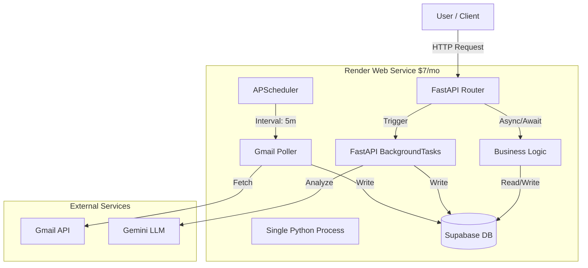

# **AI Assistant App: Product & Technical Specification**

## **Part 1: Product Requirements Document (PRD)**

### **1\. Overview**

An AI-powered assistant that automates personal organization by analyzing a user's digital inputs to manage their schedule, to-do list, and digital filing system.

### **2\. Core Value Proposition**

The system automatically ingests unstructured data from emails and photos to create structured action items, calendar events, and organized files without manual user input. It acts as a "Human-in-the-loop" filter, ensuring accuracy before committing changes to the user's permanent records.

### **3\. Phased Architecture & Roadmap**

#### **3.0. Phase 0: Proof of Concept (Current - PARTIAL)**

* **Platform:** Local Python CLI tools
* **Purpose:** Validate core data ingestion and AI extraction before building web application
* **Status:** PARTIAL (updated 2026-01-26)

**✅ Implemented Features:**
| Feature | Status | Implementation | Tests |
| :---- | :---- | :---- | :---- |
| Gmail OAuth authentication | ✅ DONE | `cli/cli_auth_gmail.py` | Integration tests |
| Email fetching and parsing | ✅ DONE | `backend/selko/services/emails.py` | Unit + Integration |
| Attachment download | ✅ DONE | `backend/selko/services/attachments.py` | Unit + Integration |
| Supabase Storage upload | ✅ DONE | With SHA-256 deduplication | Integration tests |
| RLS-enforced multi-tenancy | ✅ DONE | All tables have RLS policies | Security tests |
| **Gemini LLM integration** | ✅ DONE | `backend/selko/services/gemini.py` | 55 unit + 10 integration |
| **Calendar event extraction** | ✅ DONE | `cli/cli_extract_events.py` | Real API evals |
| **Multimodal AI (text + images)** | ✅ DONE | Email body + attachments | Integration tests |
| Unit + Integration tests | ✅ DONE | **166 total tests** (55 unit + 111 integration) | All passing |

**❌ Not Yet Implemented (MVP scope):**
- ❌ Calendar sync (write to Google Calendar API)
- ❌ Review interface (web UI)
- ❌ Undo/Redo functionality
- ❌ Automation rules
- ❌ Google Photos sync
- ❌ Web upload interface

#### **3.1. Phase 1: Web-First Cloud Processing (MVP)**

* **Platform:** Responsive Web Application (Dashboard).  
* **Server-Side Sync:** The backend handles connections to third-party providers (Cloud-to-Cloud).  
* **Processing:** All AI analysis occurs on backend servers.  
* **Notification Channel:** Web UI Notifications (Toasts/Badges) & Email Digests.

#### **3.2. Phase 2: Mobile Companion & Local Context**

* **Mobile App:** iOS/Android app for direct camera capture and local device integration.  
* **Local Inference:** On-device processing for privacy.  
* **Push Notifications:** Real-time mobile alerts.

### **4\. Functional Requirements & Data Vectors (By Domain)**

#### **Domain A: Ingestion & Input Vectors**

*The system must support the following ingestion methods for Phase 1\.*

| ID | Feature | Description | Priority | Status |
| :---- | :---- | :---- | :---- | :---- |
| **FR-A.1** | **Cloud Photo Library** | Server detects new photos added to connected providers. Primary method for "mobile" photo ingestion in Phase 1\. | **P0** | ❌ Not Started |
| **FR-A.2** | **Email Inbox** | Server detects new emails arriving in connected inboxes. Must extract attachments. | **P0** | ✅ **DONE** |
| **FR-A.3** | **Web Upload (Manual)** | Drag-and-drop zone on Web Dashboard for direct file ingestion (PDFs/Images). | **P0** | ❌ Not Started |

#### **Domain B: Intelligence Engine (AI & Logic)**

*Core processing capabilities.*

| ID | Feature | Description | Priority | Status |
| :---- | :---- | :---- | :---- | :---- |
| **FR-B.1** | **OCR & Text Extraction** | Extract text from physical images (handwriting recognition) and parse HTML/Text emails. | **P0** | ✅ **DONE** (Gemini multimodal) |
| **FR-B.2** | **Entity Extraction** | NLP to identify Entities: *Event Date*, *Time*, *Location*, *Vendor*, *Amount*. | **P0** | ✅ **DONE** (Calendar events) |
| **FR-B.3** | **Classification** | Distinguish document types: *Receipt* vs. *Invitation* vs. *Kid's Drawing* vs. *Trash*. | **P0** | 🟡 Partial (Events only) |
| **FR-B.4** | **Smart Idempotency** | Detect duplicates. **Update Logic:** If an email is an update (e.g., "Time Change"), modify the existing event rather than creating a duplicate. | **P0** | 🟡 Partial (Calendar sync idempotent) |
| **FR-B.5** | **Automation Rules** | User-defined logic (e.g., "Always accept from school@district.edu") to bypass review. | **P0** | ❌ Not Started |

#### **Domain C: User Experience & Control**

*Interaction model.*

| ID | Feature | Description | Priority | Status |
| :---- | :---- | :---- | :---- | :---- |
| **FR-C.1** | **Review Interface** | Side-by-side view (Source Asset vs. Extracted Data) allowing users to edit, approve, or reject. | **P0** | ❌ Not Started |
| **FR-C.2** | **Undo/Redo** | **Compensating Transactions:** Ability to revert any action (Create/Update/Delete) and restore original state. | **P0** | ❌ Not Started |
| **FR-C.3** | **Authentication** | Passwordless or Social Login. Granular scope management for integrations. | **P0** | ✅ **DONE** (Supabase Auth) |

#### **Domain D: System Outputs**

*External actions.*

| ID | Feature | Description | Priority | Status |
| :---- | :---- | :---- | :---- | :---- |
| **FR-D.1** | **Calendar Sync** | Create/Update events in external calendars. | **P0** | 🟡 Partial (CLI sync, idempotent) |
| **FR-D.2** | **File Storage** | Upload categorized documents to external cloud storage. | **P0** | ❌ Not Started |
| **FR-D.3** | **Task Management** | Create tasks in external task managers. | **P0** | ❌ Not Started |

### **5\. User Journeys & Example Journeys**

#### **Journey 1: The "Event Invitation" (Email \-\> Calendar)** - 🟡 PARTIAL

*Goal: User receives a PDF invite and wants it on their calendar without typing.*

| Step | User Action | System Action | Related FR | Status |
| :---- | :---- | :---- | :---- | :---- |
| 1 | User receives email with "Invite.pdf". | System detects email, ingests PDF, performs OCR. | FR-A.2, FR-B.1 | ✅ DONE |
| 2 | N/A | **AI Analysis:** Identifies Date (Oct 5), Time (2 PM), Title (Party). Classifies as "Invitation". | FR-B.2, FR-B.3 | ✅ DONE |
| 3 | User logs into Dashboard. | **Notification:** Badge on "Review" tab. | FR-C.1 | ❌ Not Started |
| 4 | User opens Review Tab. | Displays PDF side-by-side with proposed Event details. | FR-C.1 | ❌ Not Started |
| 5 | User corrects time (OCR read 5 PM as 6 PM) and clicks "Approve". | System updates payload, writes to Calendar. | FR-C.1, FR-D.1 | ❌ Not Started |
| 6 | N/A | System logs "Event Created (User Modified)" in Activity Log. | FR-C.2 | ❌ Not Started |

**Current Implementation:**
- ✅ CLI tool can extract events: `uv run python -m cli.cli_extract_events --email-id <uuid>`
- ✅ JSON output with structured CalendarEvent data
- ✅ CLI can sync events to Google Calendar: `uv run python -m cli.cli_events sync <event-id>`
- ✅ Idempotent calendar sync (updates existing events, recreates if deleted)
- ❌ No web UI yet

#### **Calendar Sync Phased Approach**

**Phase 1 (Current):** Basic idempotency + sync log table + CLI

The calendar sync is now idempotent:
1. If `google_calendar_event_id` is NULL: CREATE new calendar event
2. If `google_calendar_event_id` exists:
   - Try to UPDATE the existing event
   - If 404 (deleted from Calendar): CREATE new event with new ID
3. All syncs logged to `calendar_sync_log` table for audit trail

**Phase 2 (Future):** Smart merge with drift detection

When syncing and detecting user has manually edited the Calendar event:
1. **Preserve user changes** - their edits are authoritative
2. **Add notes for differences** - append to description like:
   > "Note: You've manually set the address as XYZ, but an email from [sender] on [date] suggests it's [our extracted address]"

This respects user agency while keeping them informed of new information from emails.

The `calendar_sync_log.snapshot_synced` field stores what we sent to Google Calendar, enabling future comparison with the actual Calendar state to detect drift.

#### **Journey 4: The "Kid's Drawing" (Photo \-\> Cloud Storage)** - ❌ NOT STARTED

*Goal: User snaps a memory, and system automatically files it to the correct folder.*

| Step | User Action | System Action | Related FR | Status |
| :---- | :---- | :---- | :---- | :---- |
| 1 | User snaps a photo of child's drawing. | Phone syncs photo to Cloud Library. | FR-A.1 | ❌ Not Started |
| 2 | N/A | Server detects new asset in Cloud Library. | FR-A.1 | ❌ Not Started |
| 3 | N/A | **AI Analysis:** Visual recognition detects content is "Hand-drawn art" or "Child's Drawing". | FR-B.3 | ❌ Not Started |
| 4 | N/A | **Rule Check:** System finds user rule: Type: Artwork \-\> Dest: /Family/Kids Art. | FR-B.5 | ❌ Not Started |
| 5 | N/A | **Execution:** System copies image to specified folder automatically (bypassing review). | FR-D.2 | ❌ Not Started |

**Rationale:** This journey is Phase 2 (after Email→Calendar works end-to-end).

## **Part 2: Technical Architecture Specification**

### **1\. High-Level Architecture Requirements**

#### **1.1 Frontend Layer**

* **Public Marketing Site:**  
  * **Requirement:** Static content delivery system optimized for SEO, landing pages, and conversion funnels.  
  * **Component:** Registration Wizard for bridging marketing to application onboarding.  
* **Web Dashboard (MVP):**  
  * **Requirement:** Responsive Single Page Application (SPA) accessible via standard web browsers.  
  * **Auth Requirement:** Integration with an Identity Provider supporting Passwordless (Magic Link) and OIDC (Social Login).  
  * **State Management:** Mechanism to poll or refresh job status without full page reloads.  
  * **Ingestion UI:** Secure drag-and-drop interface for direct file uploads.  
* **Mobile App (Phase 2):**  
  * **Requirement:** Native or Cross-Platform mobile application.  
  * **Capability:** Direct access to device camera and local storage APIs.

#### **1.2 Backend Services**

* **API Gateway:**  
  * **Requirement:** Centralized entry point for frontend clients, handling rate limiting, routing, and session validation.  
* **Ingestion Service:**  
  * **Requirement:** Background worker service capable of long-polling and handling webhooks from third-party providers.  
  * **Token Management:** Secure handling and refreshing of OAuth tokens for connected integrations.  
  * **Attachment Parsing:** Ability to recursively parse MIME types to extract embedded attachments (PDFs/Images).  
* **Orchestration Engine:**  
  * **Requirement:** State machine to manage asset lifecycle: Ingest \-\> Analyze \-\> User Review \-\> Execute.  
  * **Transaction Management:** Logic to support "Compensating Transactions" for Undo/Redo functionality.  
* **AI Service Layer:**  
  * **Requirement:** Abstraction layer to interface with OCR and LLM providers, ensuring model agnosticism.

#### **1.3 Infrastructure & Storage**

* **Object/Blob Storage:**  
  * **Requirement:** Scalable storage for unstructured data (email bodies, images, PDFs). Must support encryption at rest.  
* **Relational Database:**  
  * **Requirement:** ACID-compliant database for storing user profiles, relational metadata, taxonomy, and audit logs.  
* **Asynchronous Job Queue:**  
  * **Requirement:** Distributed queue system to decouple lightweight ingestion tasks from resource-intensive AI processing.

### **2\. Core Data Model Requirements**

#### **2.1 User & Configuration**

* **users**: Stores core identity and link to Identity Provider.  
* **integrations**: Stores connection state for third-party providers.  
  * *Critical Fields:* encrypted refresh tokens, scope lists, provider status.  
* **user\_categories**: Stores custom user taxonomy (e.g., "Tax", "Medical").

#### **2.2 Assets & Inferences (The "Brain")**

* **assets**: Represents the raw input unit.  
  * *Requirements:* Must store unique identifiers (external\_id), content hashes for deduplication, and reference links to Object Storage.  
  * *Sources:* Email Providers, Photo Libraries, Manual Uploads.  
* **inferences**: Represents the AI's findings (1 Asset can yield N Inferences).  
  * *Requirements:* Stores extracted structured data (JSON), confidence scores, and links to specific user\_categories.  
  * *States:* PENDING\_REVIEW, APPROVED, REJECTED, AUTO\_EXECUTED.

#### **2.3 History & Logic**

* **automation\_rules**: Stores user-defined logic to bypass manual review.  
  * *Logic:* Trigger (Sender/Type) \-\> Action (Accept/File) \-\> Target (Category).  
* **action\_history**: The Ledger for Undo/Redo.  
  * *Requirements:* Must store previous\_state and new\_state snapshots for every action to enable rollback.  
  * *Fields:* action\_type (CREATE, UPDATE, DELETE), external\_resource\_id (ID of the created calendar event or file).

### **3\. Workflow Logic Requirements**

#### **3.1 Ingestion, Deduplication & Updates**

1. **Ingestion:** System must handle both push (Webhooks) and pull (Polling) strategies.  
2. **Deduplication:** System must calculate and check content\_hash against existing assets to prevent duplicate processing of the same file.  
3. **Semantic Update Resolution:**  
   * System must detect if a new asset is an *update* to an existing record (e.g., a "Time Changed" email).  
   * *Action:* Create an inference marked as **UPDATE** rather than **CREATE**. Merge new values over old values.

#### **3.2 Analysis & Classification**

1. **Processing:** System must perform OCR on images and parsing on text/HTML.  
2. **Rule Evaluation:** System must query automation\_rules before adding to the Review Queue.  
   * *Match:* Execute immediately.  
   * *No Match:* Queue for user review.

#### **3.3 The Review Queue**

1. **UI Requirement:** Must display the source asset (left) and the editable extracted data (right) simultaneously.  
2. **Conflict Resolution:** If the item is an **UPDATE**, the UI must highlight the "Before" vs "After" changes.

#### **3.4 Execution & Undo/Redo**

1. **Execution:** System must write to the external provider (Calendar/Drive) and store the resulting external ID.  
2. **Compensating Transactions (Undo):**  
   * *Requirement:* Triggering "Undo" must reverse the external action.  
   * *Create Undo:* Triggers external DELETE.  
   * *Update Undo:* Triggers external UPDATE (restoring previous\_state).  
   * *Reject Undo:* Triggers state restoration to PENDING\_REVIEW.

---

## **Part 3: Implementation Architecture**

### **0. Current Implementation Status**

**Last Updated:** 2026-01-26

**✅ Completed Components:**

| Component | Status | Files | Tests |
|-----------|--------|-------|-------|
| **Data Layer** | ✅ Complete | `supabase/migrations/` | 166 passing |
| **Gmail Integration** | ✅ Complete | `selko/services/gmail.py` | 5 integration tests |
| **Email Pipeline** | ✅ Complete | `selko/services/emails.py` | 9 integration tests |
| **Attachment Storage** | ✅ Complete | `selko/services/attachments.py` | 8 integration tests |
| **Gemini LLM Integration** | ✅ Complete | `selko/services/gemini.py` | 55 unit + 10 integration |
| **Calendar Event Extraction** | ✅ Complete | `selko/api/schemas/calendar.py` | Real API evals |
| **CLI Tools** | ✅ Complete | `cli/*.py` (7 tools) | 10 CLI integration tests |
| **Authentication** | ✅ Complete | `selko/services/auth.py` | 6 auth tests |
| **RLS Security** | ✅ Complete | All tables | 8 security tests |

**❌ Not Yet Implemented:**

| Component | Priority | Blocker | Next Steps |
|-----------|----------|---------|------------|
| **Google Calendar API** | P0 | None | Write events to calendar |
| **Review Web UI** | P0 | Calendar API | FastAPI endpoints + frontend |
| **Undo/Redo** | P0 | Calendar API | Compensating transactions |
| **Automation Rules** | P0 | Review UI | Database schema + logic |
| **Google Photos** | P1 | End-to-end Email→Calendar | Similar to Gmail integration |
| **Web Upload** | P1 | Review UI | Frontend drag-and-drop |

**Current Capability:**
- ✅ Fetch emails from Gmail (OAuth authenticated)
- ✅ Download and store attachments (SHA-256 deduplication)
- ✅ Extract calendar events from emails using Gemini LLM
- ✅ Process multimodal content (email body + image attachments)
- ❌ Cannot yet write events to Google Calendar
- ❌ No web UI for reviewing/approving events

**Next Milestone: End-to-End Email → Calendar**
1. Implement Google Calendar API integration
2. Build review interface (web UI)
3. Add undo/redo functionality
4. Complete first user journey

---

### **1. System Overview**

Selko is an AI-powered assistant that automates personal organization by analyzing digital inputs (emails, photos) to manage schedules, to-do lists, and digital filing systems.

```
┌─────────────────────────────────────────────────────────────────────────────┐
│                              SELKO ARCHITECTURE                              │
├─────────────────────────────────────────────────────────────────────────────┤
│                                                                              │
│  ┌─────────────┐    ┌─────────────┐    ┌─────────────┐    ┌─────────────┐   │
│  │   Gmail     │    │   Google    │    │   Web       │    │   Manual    │   │
│  │   API       │    │   Photos    │    │   Upload    │    │   Camera    │   │
│  └──────┬──────┘    └──────┬──────┘    └──────┬──────┘    └──────┬──────┘   │
│         │                  │                  │                  │          │
│         └──────────────────┴────────┬─────────┴──────────────────┘          │
│                                     ▼                                        │
│                    ┌────────────────────────────────────┐                   │
│                    │       INGESTION LAYER              │                   │
│                    │  (OAuth, MIME parsing, Storage)    │                   │
│                    └────────────────┬───────────────────┘                   │
│                                     │                                        │
│                                     ▼                                        │
│                    ┌────────────────────────────────────┐                   │
│                    │      SUPABASE (PostgreSQL)         │                   │
│                    │  ┌──────────┐  ┌──────────────┐    │                   │
│                    │  │  emails  │  │ attachments  │    │                   │
│                    │  └──────────┘  └──────────────┘    │                   │
│                    │  ┌──────────────────────────────┐  │                   │
│                    │  │    Supabase Storage (S3)     │  │                   │
│                    │  └──────────────────────────────┘  │                   │
│                    └────────────────┬───────────────────┘                   │
│                                     │                                        │
│                                     ▼                                        │
│                    ┌────────────────────────────────────┐                   │
│                    │      INTELLIGENCE ENGINE           │                   │
│                    │   (Gemini LLM - multimodal)        │                   │
│                    │  ┌─────────────────────────────┐   │                   │
│                    │  │ OCR, Entity Extraction,     │   │                   │
│                    │  │ Classification, Update      │   │                   │
│                    │  │ Detection                   │   │                   │
│                    │  └─────────────────────────────┘   │                   │
│                    └────────────────┬───────────────────┘                   │
│                                     │                                        │
│                                     ▼                                        │
│                    ┌────────────────────────────────────┐                   │
│                    │      REVIEW INTERFACE              │                   │
│                    │   (Human-in-the-loop)              │                   │
│                    │  ┌─────────────────────────────┐   │                   │
│                    │  │ Source ←→ Extracted Data    │   │                   │
│                    │  │ Approve / Edit / Reject     │   │                   │
│                    │  └─────────────────────────────┘   │                   │
│                    └────────────────┬───────────────────┘                   │
│                                     │                                        │
│         ┌───────────────────────────┼───────────────────────────┐           │
│         ▼                           ▼                           ▼           │
│  ┌─────────────┐           ┌─────────────┐            ┌─────────────┐       │
│  │   Google    │           │   Cloud     │            │    Task     │       │
│  │   Calendar  │           │   Storage   │            │   Manager   │       │
│  └─────────────┘           └─────────────┘            └─────────────┘       │
│                                                                              │
└─────────────────────────────────────────────────────────────────────────────┘
```

### **2. Development Phases**

#### **Phase 0: Proof of Concept**
- **Status:** COMPLETE (2026-01-23)
- **Goal:** Validate core data ingestion and storage
- **Components:** CLI tools, Supabase (PostgreSQL + Storage), Gmail API
- **Features implemented:**
  - Gmail OAuth authentication
  - Email fetching and parsing
  - Attachment download and storage
  - Content deduplication (SHA-256)
  - RLS-enforced multi-tenancy

#### **Phase 1: MVP (Web-First Cloud Processing)**
- **Status:** 🟡 IN PROGRESS (started 2026-01-25)
- **Goal:** Complete end-to-end journey: Email → LLM → Calendar
- **Components:** FastAPI, Gemini LLM, Google Calendar API
- **Implementation progress:**
  1. ✅ **LLM integration (Gemini 3 Flash)** - DONE (2026-01-26)
  2. ✅ **Email → LLM analysis pipeline** - DONE (2026-01-26)
  3. ❌ Calendar sync (write events) - NOT STARTED
  4. ❌ Review interface (web dashboard) - NOT STARTED
  5. ❌ Undo/Redo functionality - NOT STARTED
  6. ❌ Automation rules - NOT STARTED

#### **Phase 2: Extended Inputs**
- **Status:** FUTURE
- **Goal:** Add more input sources after Email→Calendar works
- **Features:**
  - Google Photos sync
  - Web upload interface
  - Direct camera capture (mobile)

#### **Phase 3: Mobile Companion**
- **Status:** FUTURE
- **Goal:** Native mobile app with on-device processing
- **Features:**
  - iOS/Android apps
  - Local LLM inference
  - Push notifications

### **3. Key Architectural Principles**

#### **3.1 Direct Supabase Access (No Proxy Layers)**
**CRITICAL:** Frontends query Supabase directly. No superfluous API layers.

All frontends (Web, Android, iOS) must:
1. **Query Supabase directly** for all data operations (emails, events, integrations, etc.)
2. **Use RLS (Row Level Security)** for access control - enforced at database level
3. **Only call Python API** for operations requiring server-side secrets:
   - OAuth flows (client secrets)
   - Gmail sync (API credentials)
   - LLM processing (Gemini API key)
   - Google Calendar sync (API credentials)

**Why:**
- Reduced latency (Frontend → Supabase vs Frontend → Python → Supabase)
- Simpler backend (9 endpoints instead of 35)
- RLS provides consistent security across all access paths
- Each frontend uses its native Supabase SDK

**The Python API is NOT a general-purpose REST API.** See `docs/supabase-frontend-queries.md` for frontend query patterns.

#### **3.2 End-to-End First**
Complete full journeys before expanding scope:
- Do NOT add Google Photos until Email→Calendar works end-to-end
- Do NOT add Task Management until Calendar integration is complete
- Each input→output path must be fully functional before adding more

#### **3.4 LLM-Centric Intelligence**
All intelligence features use the same multimodal LLM (Gemini):
- OCR & text extraction → LLM reads images/PDFs directly
- Entity extraction → LLM extracts dates, times, locations
- Document classification → LLM categorizes content
- No separate OCR service needed - the LLM is multimodal

#### **3.5 Human-in-the-Loop**
Every automated action goes through review:
- Side-by-side view of source vs. extracted data
- User can approve, edit, or reject
- Automation rules can bypass review for trusted sources
- Undo/Redo for all actions

#### **3.6 Simplified Stack (YAGNI)**
Add complexity only when measured need exists:
- POC: CLI + Supabase (2 components, $0/mo)
- MVP: Add FastAPI (still 2 components)
- Scale: Add Redis only when PostgreSQL queue insufficient

### **4. The "Async Monolith" Architecture**

We implement the **"Async Monolith"** pattern. A single Docker container handles three distinct workloads concurrently using Python's `asyncio` event loop.

#### **4.1 Component Overview**



#### **4.2 The Three Workloads**

1.  **REST API (FastAPI):**
    *   Handles real-time requests from the frontend/CLI.
    *   **Tech:** `FastAPI` + `Uvicorn`.
    *   **Why:** Native async support is critical for I/O-bound operations (calling Gmail/Gemini) without blocking the main thread. Pydantic provides free validation.

2.  **Cron Scheduler (APScheduler):**
    *   Handles periodic polling (e.g., "Check Gmail every 5 minutes").
    *   **Tech:** `APScheduler` (`AsyncIOScheduler`).
    *   **Implementation:** Initialized in `app.on_event("startup")`. Runs inside the same event loop as the API.
    *   **Rationale:** Eliminates the need for external cron services (GitHub Actions, Cloud Scheduler) or separate "Clock" processes.

3.  **Background Workers (Status-Based Polling):**
    *   Handles async tasks by polling data tables directly (e.g., "Process pending emails", "Sync approved events").
    *   **Tech:** Status-based claiming from data tables + asyncio worker pool.
    *   **Implementation:** Workers claim work directly from `emails` and `events` tables via `FOR UPDATE SKIP LOCKED`. No separate job queue - data tables ARE the queue. `scheduled_tasks` table only for periodic tasks (email_fetch).
    *   **Rationale:** Single source of truth (data IS the queue), no job-data synchronization bugs, simpler debugging. Removes the need for Redis, Celery, or a separate worker process.
    *   **Status:** ✅ IMPLEMENTED (2026-01-27) - Status-based worker pool for email processing and calendar sync.

### **5. Technology Stack Decisions**

| Layer | Component | Purpose | Decision Rationale |
|-------|-----------|---------|-------------------|
| **Data** | Supabase PostgreSQL | Relational data, RLS | Managed Postgres, no OPS overhead |
| **Storage** | Supabase Storage | Attachment files (S3-compatible) | Integrated with auth/RLS |
| **API** | FastAPI | REST API, async processing | Async-native, auto-docs, type-safe |
| **AI** | Gemini (Vertex AI) | Multimodal LLM | Native multimodal support |
| **Auth** | Supabase Auth | User management, JWT | Built-in RLS integration |
| **Hosting** | Render (Starter Plan) | Application deployment | $7/mo, 24/7 uptime, simple deploys |

#### **5.1 Why FastAPI**
- **Async Native:** Heavily I/O bound (Gmail API, Gemini API, Supabase API). Blocking frameworks would choke concurrency.
- **Developer Experience:** Pydantic models offer strict typing and auto-generated OpenAPI docs.
- **Supabase Compatibility:** Works natively with the async Supabase Python client.

#### **5.2 Why Supabase**
- **Managed Postgres:** No OPS overhead.
- **Auth:** Handles JWTs, Row Level Security (RLS) policies out of the box.
- **Storage:** S3-compatible storage for email attachments.

#### **5.3 Why Render**
- **No Sleep:** Free tier sleeps after inactivity, which kills the Scheduler. Starter plan ($7/mo) runs 24/7.
- **Simplicity:** "Git Push" deployment. No complex IAM, no Kubernetes, no manual VPS configuration.
- **Predictable Cost:** Flat $7/mo. No opaque bandwidth/CPU credits.
- **Concurrency:** Starter plan (0.5 CPU) handles concurrent async requests well for expected MVP volume.

### **6. Rejected Alternatives**

#### **6.1 Rejection: Serverless (Google Cloud Run / AWS Lambda)**
- **Problem:** Serverless instances spin down to zero when idle. This kills the `APScheduler`.
- **Workaround Cost:** Keeping a Cloud Run instance "Always On" costs ~$25+/mo.
- **Complexity:** Requires external "Pingers" (Cloud Scheduler) to trigger polling, splitting logic and adding IAM permission complexity.

#### **6.2 Rejection: Microservices / Separate Workers**
- **Architecture:** Deploying a separate "Worker" service for background jobs.
- **Problem:** On Render, this doubles the cost ($7 for API + $7 for Worker = $14/mo).
- **Complexity:** Requires Redis ($10/mo+) to pass messages between API and Worker.
- **Verdict:** Overkill for a solo dev MVP.

#### **6.3 Rejection: Django**
- **Problem:** ORM is heavy and synchronous. Conflicts with the Supabase RLS pattern (Django wants to own the database user). Overkill for an API-first backend.

### **7. Deployment Strategy**

#### **7.1 Configuration**
*   **Repo:** GitHub.
*   **Render Config:** Connect repo → Select "Web Service".
*   **Build Command:** `uv pip install -r pyproject.toml` (or Dockerfile).
*   **Start Command:** `uvicorn selko.api.app:app --host 0.0.0.0 --port $PORT`
*   **Env Vars:**
    *   `SUPABASE_URL`
    *   `SUPABASE_KEY`
    *   `GOOGLE_CREDENTIALS` (JSON string)

#### **7.2 Code Structure**

See `backend/selko/api/app.py` for the FastAPI application structure with APScheduler integration.

### **8. Security Model**

#### **8.1 Row-Level Security (RLS)**
All database access is controlled by Supabase RLS policies:
- Users can only see their own data
- Service role key for admin operations only
- User credentials (JWT) for all normal operations

#### **8.2 OAuth 2.0**
External integrations use OAuth with minimal scopes:
- Gmail: `gmail.readonly` (read-only access)
- Calendar: `calendar.events` (event management)
- Photos: `photoslibrary.readonly` (read-only access)

#### **8.3 Storage Isolation**
Supabase Storage uses user-scoped paths:
- Pattern: `{user_id}/{unique_id}_{filename}`
- RLS policies enforce folder-level access
- Users cannot access other users' files

### **9. Future Scalability (When to break the Monolith)**

We will stick to this $7 Monolith until we hit specific breaking points:

1.  **CPU Saturation:** If AI processing (OCR/Embedding) starts blocking the CPU, causing API latency.
    *   *Solution:* Move AI tasks to a separate Render Background Worker + Redis.
2.  **Memory Limits:** If the 512MB RAM (Starter Plan) is exceeded.
    *   *Solution:* Upgrade Render plan ($7 → $25).
3.  **Scale:** If we exceed ~50-100 concurrent requests.
    *   *Solution:* Horizontal scaling (Render handles this easily).

**Current Status:** The Monolith is sufficient for < 10,000 users given the async nature of our workload.

---

## **Part 4: Testing Strategy**

### **1. Overview**

Integration tests validate end-to-end functionality with real services (Supabase, Gmail API) rather than mocked dependencies. The tests are organized by environment to ensure proper isolation and safety.

**All integration tests use real Gmail API.** No mocking ensures tests validate actual 3rd-party integration behavior.

### **2. Environment Strategy**

| Environment | Database | Gmail API | Purpose | Safety Level |
|-------------|----------|-----------|---------|--------------|
| **Development** | Local Supabase (Docker) | Real (seeded tokens) | Fast iteration, CI/CD | Safe (isolated) |
| **Staging** | Cloud Supabase (staging) | Real (burner account) | Pre-production validation | Safe (test data only) |
| **Production** | Cloud Supabase (prod) | Real (read-only) | Smoke tests only | Restricted (read-only) |

#### **2.1 Development Environment Tests**
- **Database**: Local Supabase via Docker (`supabase start`)
- **Gmail**: Real Gmail API with tokens seeded from staging
- **Credentials**: OAuth tokens copied via `cli_seed_tokens` with user ID remapping
- **Purpose**: Test real Gmail integration without deploying to staging or polluting cloud DB
- **Cleanup**: `supabase db reset` clears everything, re-seed tokens as needed
- **CI**: Tokens automatically seeded from staging before tests run

**Setup:**
```bash
# One-time setup after supabase start/reset
supabase start
uv run python -m cli.cli_user create --email test@selko.local --password testpass123 --auto-confirm
uv run python -m cli.cli_seed_tokens --from staging --to development --provider gmail

# Run development tests (uses real Gmail)
uv run pytest backend/tests/integration/ -m "development" -v
```

#### **2.2 Staging Environment Tests**
- **Database**: Cloud Supabase staging instance (`lxmysergoeaegxlyfzwk`)
- **Gmail**: Real Gmail API with dedicated burner account
- **Credentials**: Real OAuth tokens stored in staging DB
- **Purpose**: Validate real-world integrations before production
- **Cleanup**: Delete test data after each test run

#### **2.3 Production Environment Tests**
- **Database**: Cloud Supabase production instance (`khahcozfbnpykspvatrg`)
- **Gmail**: Read-only operations only (no sending, no modifications)
- **Purpose**: Smoke tests to verify production health
- **Restrictions**: No data creation, no destructive operations

### **3. Test Categories**

#### **3.1 Authentication Tests** (`test_integration_auth.py`)
Tests the user authentication flow with real Supabase Auth.

| Test | Development | Staging | Production |
|------|-------------|---------|------------|
| Sign in with valid credentials | ✓ | ✓ | ✓ (read-only) |
| Sign in with invalid credentials (error handling) | ✓ | ✓ | ✗ |
| Get current user ID from session | ✓ | ✓ | ✓ |
| Session token refresh | ✓ | ✓ | ✗ |
| Sign out and invalidate session | ✓ | ✓ | ✗ |

#### **3.2 User Management Tests** (`test_integration_users.py`)
Tests admin operations using service role key.

| Test | Development | Staging | Production |
|------|-------------|---------|------------|
| Create user with auto-confirm | ✓ | ✗ | ✗ |
| Create user with email verification | ✗ | ✓ | ✗ |
| List all users | ✓ | ✓ | ✗ |
| Delete user (cascades integrations/emails) | ✓ | ✓ | ✗ |
| User profile auto-created on auth signup | ✓ | ✓ | ✗ |

#### **3.3 OAuth Integration Tests** (`test_integration_oauth.py`)
Tests storing and retrieving OAuth credentials from the database.

| Test | Development | Staging | Production |
|------|-------------|---------|------------|
| Save Gmail OAuth credentials | ✓ | ✓ | ✗ |
| Retrieve and reconstruct Credentials object | ✓ | ✓ | ✓ |
| Update existing credentials (upsert) | ✓ | ✓ | ✗ |
| Handle expired token status | ✓ | ✓ | ✗ |
| Unique constraint (user_id, provider) | ✓ | ✓ | ✗ |
| Scopes array storage | ✓ | ✓ | ✓ |

#### **3.4 Gmail API Tests** (`test_integration_gmail.py`)
Tests Gmail API interactions. **Requires burner Gmail account for staging.**

| Test | Development | Staging | Production |
|------|-------------|---------|------------|
| OAuth flow (interactive) | Manual | Manual | ✗ |
| Build Gmail service from credentials | ✓ (real) | ✓ (real) | ✗ |
| Get user profile (email address) | ✓ (real) | ✓ (real) | ✗ |
| Fetch messages (list) | ✓ (real) | ✓ (real) | ✗ |
| Fetch message details | ✓ (real) | ✓ (real) | ✗ |
| Token refresh on expiry | ✓ (real) | ✓ (real) | ✗ |

#### **3.5 Email Pipeline Tests** (`test_integration_emails.py`)
Tests the complete email fetch → parse → store pipeline.

| Test | Development | Staging | Production |
|------|-------------|---------|------------|
| Parse Gmail message structure | ✓ | ✓ | ✗ |
| Store email in database | ✓ | ✓ | ✗ |
| Upsert on duplicate gmail_id | ✓ | ✓ | ✗ |
| Trigger parses labels into flags | ✓ | ✓ | ✗ |
| Content hash deduplication | ✓ | ✓ | ✗ |
| RLS: user sees only own emails | ✓ | ✓ | ✗ |

#### **3.6 End-to-End Pipeline Tests** (`test_integration_e2e.py`)
Tests complete user journeys across multiple services.

| Test | Development | Staging | Production |
|------|-------------|---------|------------|
| New user: create → auth → gmail → fetch | ✓ | ✓ | ✗ |
| Existing user: sign in → fetch new emails | ✓ | ✓ | ✗ |
| Delete user cascades all data | ✓ | ✓ | ✗ |

#### **3.7 CLI Integration Tests** (`test_integration_cli.py`)
Tests CLI tools as subprocess to validate argument parsing and output.

| Test | Development | Staging | Production |
|------|-------------|---------|------------|
| cli_user create/list/delete | ✓ | ✓ | ✗ |
| cli_fetch_emails --max N | ✓ | ✓ | ✗ |
| --env flag overrides environment | ✓ | ✓ | ✗ |
| -v verbose logging | ✓ | ✓ | ✗ |
| -q quiet mode | ✓ | ✓ | ✗ |

### **4. Test Infrastructure**

#### **4.1 Directory Structure**

```
backend/
└── tests/
    ├── conftest.py              # Shared fixtures
    ├── test_config.py           # Unit tests
    ├── test_emails.py           # Unit tests
    ├── test_integrations.py     # Unit tests
    └── integration/             # Integration tests
        ├── __init__.py
        ├── conftest.py          # Integration-specific fixtures
        ├── test_integration_auth.py
        ├── test_integration_users.py
        ├── test_integration_oauth.py
        ├── test_integration_gmail.py
        ├── test_integration_emails.py
        ├── test_integration_e2e.py
        └── test_integration_cli.py
```

#### **4.2 Pytest Markers**

```python
# backend/pyproject.toml
[tool.pytest.ini_options]
markers = [
    "integration: marks tests as integration tests (deselect with '-m \"not integration\"')",
    "development: tests that run against local Supabase with real Gmail (requires seeded tokens)",
    "staging: tests that run against staging Supabase + real Gmail",
    "production: read-only smoke tests for production",
    "slow: tests that take >10 seconds",
]
```

#### **4.3 Running Tests**

**Local Development (Pre-commit):**
```bash
# Run all tests (unit + integration) before committing
supabase start  # If not already running
uv run pytest backend/tests/ -v

# Or run separately:
# Unit tests only (fast, no external dependencies)
uv run pytest backend/tests/ -m "not integration" -v

# Integration tests only (requires local Supabase + seeded tokens)
uv run pytest backend/tests/integration/ -m "development" -v
```

**CI/CD Testing:**
Staging tests run in CI only, after deploying to staging, to validate the deployed environment. They are not meant to be run locally before commits.

```bash
# Staging tests (CI only, runs after deployment)
ENVIRONMENT=staging uv run pytest backend/tests/integration/ -m "staging" -v

# Smoke tests for production (CI only, read-only)
ENVIRONMENT=production uv run pytest backend/tests/integration/ -m "production" -v
```

**Note:** Development integration tests already validate real Gmail API using seeded tokens. Running staging tests locally before deployment tests nothing useful (you're testing stale staging state, not your changes).

### **5. Burner Gmail Account Setup**

#### **5.1 One-Time Setup (Manual)**

1. **Create burner Gmail account:**
   - Account: `selko-staging-test@gmail.com` (example)
   - Use a strong password, store securely
   - Enable 2FA for security

2. **Google Cloud Console setup:**
   - Create project or use existing Selko project
   - Enable Gmail API
   - Add burner account email to OAuth consent screen test users

3. **Authorize OAuth for staging:**
   ```bash
   # Run once to authorize and store tokens
   ENVIRONMENT=staging uv run python -m cli.cli_auth_gmail
   ```
   - Complete OAuth flow in browser
   - Tokens stored in staging database `integrations` table

4. **Prepare test data in Gmail:**
   - Send a few test emails to the burner account
   - Include various label types (starred, important, promotions)
   - Keep inbox small (<100 emails) for fast tests

#### **5.2 Token Refresh Handling**

OAuth tokens expire after 1 hour. The staging tests should:
1. Check if token is expired before running
2. Use refresh token to get new access token
3. Update stored credentials in database

This is already implemented in `gmail.get_credentials()` with `creds.refresh()`.

#### **5.3 Making Tests Fully Automatic (No Manual Re-auth)**

**The Problem**: Google OAuth refresh tokens have different lifetimes depending on app status:

| App Status | Refresh Token Lifetime | Manual Re-auth Needed? |
|------------|------------------------|------------------------|
| **Testing** (unpublished) | **7 days** | Yes, weekly |
| **Published** (internal or external) | Indefinite* | No |

*Unless user revokes access or you request new scopes

**The Solution**: Publish the OAuth app to get indefinite refresh tokens.

**Steps to enable fully automatic tests:**

1. **Google Cloud Console → OAuth consent screen**
2. **Change status from "Testing" to "In Production"**
3. **Select "Internal"** (if using Google Workspace) or publish externally with limited scopes
4. Once published, refresh tokens won't expire

**After publishing:**
- Staging tests run indefinitely without manual intervention
- CI/CD only needs environment variables (Supabase URL/keys, test user credentials)
- OAuth tokens live in database and auto-refresh via `gmail.get_credentials()`

### **6. CI/CD Integration**

#### **6.1 GitHub Actions Workflow**

```yaml
# .github/workflows/test.yml
name: Tests

on: [push, pull_request]

jobs:
  unit-tests:
    runs-on: ubuntu-latest
    steps:
      - uses: actions/checkout@v4
      - uses: astral-sh/setup-uv@v4
      - run: uv sync --extra test
      - run: uv run pytest backend/tests/ -m "not integration" -v

  integration-tests-development:
    runs-on: ubuntu-latest
    services:
      supabase:
        # Use Supabase CLI in Docker or local setup
    steps:
      - uses: actions/checkout@v4
      - uses: astral-sh/setup-uv@v4
      - uses: supabase/setup-cli@v1
      - run: supabase start
      - run: uv sync --extra test
      - run: uv run pytest backend/tests/integration/ -m "development" -v
    env:
      ENVIRONMENT: development

  integration-tests-staging:
    runs-on: ubuntu-latest
    # Only run on main branch or manual trigger
    if: github.ref == 'refs/heads/main' || github.event_name == 'workflow_dispatch'
    steps:
      - uses: actions/checkout@v4
      - uses: astral-sh/setup-uv@v4
      - run: uv sync --extra test
      - run: uv run pytest backend/tests/integration/ -m "staging" -v
    env:
      ENVIRONMENT: staging
      SUPABASE_URL: ${{ secrets.STAGING_SUPABASE_URL }}
      SUPABASE_PUBLISHABLE_KEY: ${{ secrets.STAGING_SUPABASE_PUBLISHABLE_KEY }}
      SUPABASE_SERVICE_ROLE_KEY: ${{ secrets.STAGING_SUPABASE_SERVICE_ROLE_KEY }}
      TEST_USER_EMAIL: ${{ secrets.STAGING_TEST_USER_EMAIL }}
      TEST_USER_PASSWORD: ${{ secrets.STAGING_TEST_USER_PASSWORD }}
```

### **7. Success Criteria**

Integration tests are complete when:

1. **Coverage**: All services have integration tests
2. **Environments**: Tests run in development and staging
3. **Reliability**: Tests pass consistently (no flaky tests)
4. **Speed**: Development tests complete in <2 minutes
5. **CI/CD**: Automated testing in GitHub Actions
6. **Documentation**: Clear setup instructions for new developers