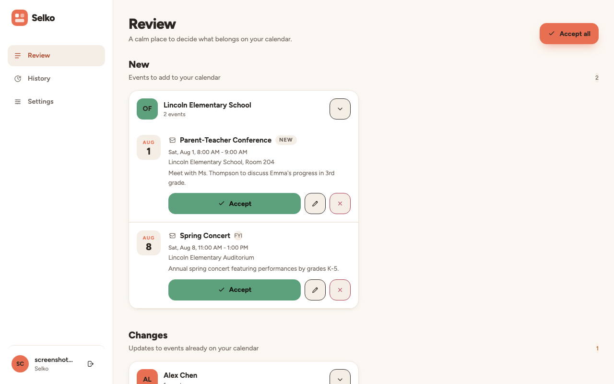
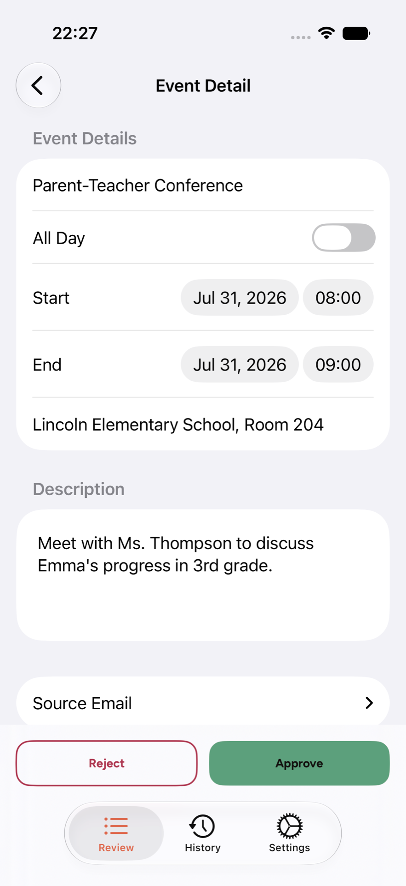
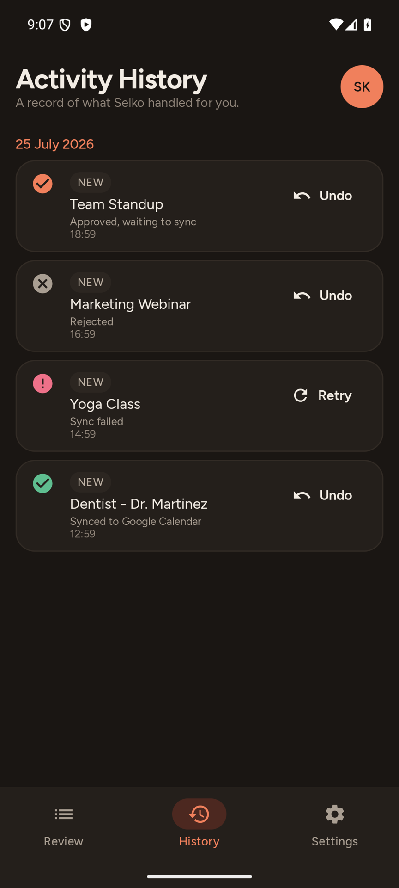
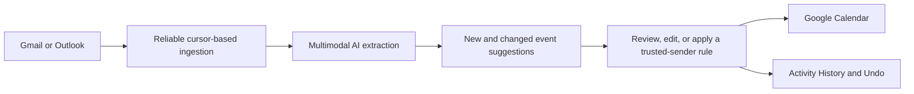

# Selko

### Your inbox already knows what is happening. Selko turns it into a calendar you can trust.

School reminders, appointments, reservations, community events, tickets, and
schedule changes arrive scattered across email threads and attachments. Selko
reads that information, understands the details, and turns it into clear
calendar suggestions—without asking you to copy dates, decipher PDFs, or hunt
through your inbox again.

**Selko is live in production on web, iOS, and Android.**

## From email overload to a calm review queue

Selko connects to Gmail or Outlook, extracts the events that matter, and shows
you exactly what it found. You can edit, approve, or reject each suggestion
before it reaches Google Calendar. Trusted-sender rules are opt-in for the
things you genuinely want automated.

It also recognizes updates to events you already have. Instead of creating a
duplicate, Selko presents the proposed changes and lets you review the
before-and-after details.

<table>
  <tr>
    <td width="58%" align="center">
      <a href="docs/screenshots/web-review-queue-desktop-light.png">
        
      </a>
      <br><sub>Web review queue</sub>
    </td>
    <td width="21%" align="center">
      <a href="docs/screenshots/ios-event-detail-light.png">
        
      </a>
      <br><sub>iOS event review</sub>
    </td>
    <td width="21%" align="center">
      <a href="docs/screenshots/android-history-dark.png">
        
      </a>
      <br><sub>Android activity history</sub>
    </td>
  </tr>
</table>

## What Selko does

- **Understands real email** — reads Gmail and Outlook messages plus PDFs,
  images, and other supported attachments.
- **Finds the useful details** — resolves dates, times, time zones, locations,
  all-day events, and recurrence from natural language.
- **Creates suggestions, not surprises** — new events enter a human review
  queue by default.
- **Handles changes intelligently** — matches related calendar events and
  presents field-level updates instead of creating duplicates.
- **Syncs safely with Google Calendar** — approved events are inserted or
  updated idempotently.
- **Keeps an activity record** — History shows what happened, exposes failed
  syncs, supports retry, and lets you undo changes.
- **Learns your explicit preferences** — ignore noisy senders or opt trusted
  senders into automatic approval.
- **Works wherever you are** — responsive web app plus native SwiftUI and
  Jetpack Compose clients.

## Designed around control

Selko's goal is not maximum automation. It is dependable assistance.

- Your inbox is read through provider OAuth.
- OAuth tokens stay server-side.
- Per-user Row-Level Security protects application data.
- Calendar writes are traceable and recoverable.
- Existing Google Calendar changes are compared before undo; if something
  differs, Selko shows the exact conflict before offering Force Undo.
- Extraction quality is measured against a curated regression eval suite, and
  production parsing failures become new eval cases.

## How it works



Selko uses an eval-backed primary/fallback model route rather than depending on
one model or one provider. The current default pair is Gemini
`gemini-3.5-flash-lite` with Qwen `qwen3.7-flash` fallback; the provider
registry also supports Anthropic and OpenAI models.

## Product status

The end-to-end Email → Review → Google Calendar journey is in production.
Current work is focused on recovery and immediacy: automatically catching up
after an OAuth reconnection and delivering live cross-client updates without a
manual refresh. See the implementation plans for
[OAuth reconnect catch-up](docs/specs/oauth-reconnect-catch-up.md) and
[live UI updates](docs/specs/live-ui-updates.md).

## Architecture

Frontends query Supabase directly for RLS-protected application data. FastAPI
handles operations that require secrets: OAuth, provider ingestion, LLM
processing, and Google Calendar writes. PostgreSQL rows are also the durable
work queues; workers claim them with locks and bounded retries.

```text
Web / iOS / Android
        │
        ├── RLS-protected data ──────────────→ Supabase
        │                                      PostgreSQL + Auth + Storage
        │
        └── secret-bearing operations ───────→ FastAPI
                                               OAuth + providers + AI
                                                        │
                                                        └── background workers
```

### Stack

- **Web:** SvelteKit 2, Svelte 5, DaisyUI
- **iOS:** SwiftUI
- **Android:** Kotlin, Jetpack Compose, Koin
- **Backend:** Python, FastAPI, Pydantic
- **Data:** Supabase PostgreSQL, Auth, Storage, RLS
- **AI:** multimodal, multi-provider LLM gateway with validated fallback
- **Tooling:** `uv`, npm, Gradle, Xcode

See [PRD_ARCH.md](PRD_ARCH.md) for product requirements and architecture.

## Local development

### Prerequisites

- Python 3.14+
- [uv](https://github.com/astral-sh/uv)
- [Supabase CLI](https://supabase.com/docs/guides/cli)
- Docker Desktop
- Node.js for the web client
- Xcode or Android Studio for native clients

### Setup

```bash
git clone https://github.com/tonimelisma/selko.git
cd selko
uv sync
cp .env.example .env
supabase start
supabase db reset
```

Run the backend:

```bash
uv run python -m selko.api
```

Run the web client:

```bash
cd frontend
npm install
npm run dev
```

The repository supports isolated development, staging, and production
configuration through `.env`, `.env.test`, and `.env.production`.

## Testing

```bash
# Backend unit tests
uv run pytest backend/tests/ -m "not integration"

# Frontend
cd frontend
npm run test:unit
npm run check
```

Platform-specific commands and required visual verification are documented in
[AGENTS.md](AGENTS.md) and [docs/testing-guide.md](docs/testing-guide.md).

## Documentation

| Document | Purpose |
|---|---|
| [PRD_ARCH.md](PRD_ARCH.md) | Product requirements and architecture |
| [docs/manual-email-to-calendar-walkthrough.md](docs/manual-email-to-calendar-walkthrough.md) | End-to-end product walkthrough |
| [docs/database-schema.md](docs/database-schema.md) | Database reference |
| [docs/job-queue.md](docs/job-queue.md) | Background-worker architecture |
| [docs/gmail-integration.md](docs/gmail-integration.md) | Gmail ingestion |
| [docs/llm-integration.md](docs/llm-integration.md) | Model routing and extraction |
| [docs/evals-process.md](docs/evals-process.md) | Regression eval workflow |
| [docs/specs/README.md](docs/specs/README.md) | Planned and in-progress implementation specs |

## License

Proprietary, commercially copyrighted software. Copyright © 2026 Toni Melisma.
All rights reserved.
