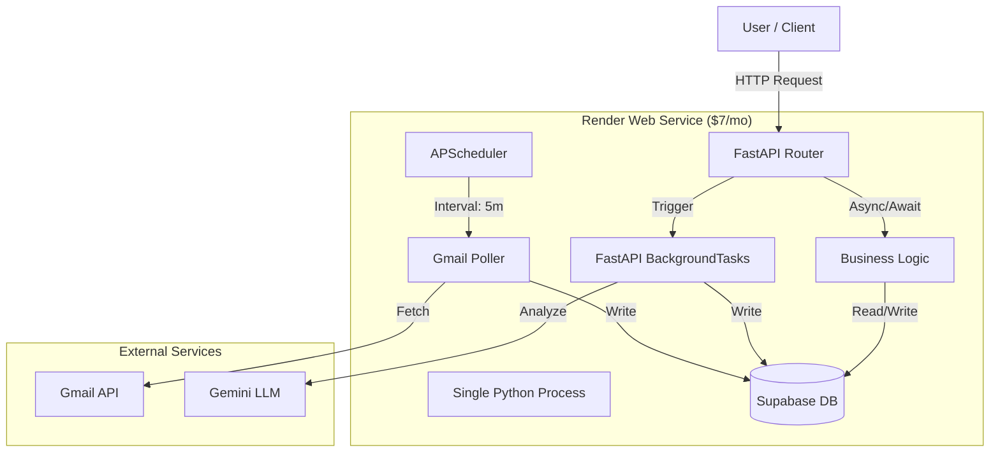

# Selko Technical Architecture & Stack Decisions

**Date:** 2026-01-24
**Status:** APPROVED
**Context:** Solo Developer, MVP Phase, "Keep It Simple" Mandate

## 1. Executive Summary

This document defines the technical architecture for Selko. It supersedes previous evaluation documents (`BACKEND_FRAMEWORK_EVALUATION.md`, `HOSTING_EVALUATION.md`, `SIMPLIFIED_STACK.md`) and consolidates our decisions into a single source of truth.

**Core Philosophy:** "The Monolith."
We reject microservices, serverless functions, and distributed queues for the MVP. Instead, we bundle all capability (API, Scheduling, Workers) into a single, efficient, always-on Python process.

**The Stack:**
*   **Framework:** FastAPI (Python)
*   **Database/Auth:** Supabase
*   **Hosting:** Render (Starter Plan)
*   **Cost:** ~$7/month (Predictable)

---

## 2. The Monolith Architecture

We will implement the **"Async Monolith"** pattern. A single Docker container handles three distinct workloads concurrently using Python's `asyncio` event loop.

### 2.1 Component Diagram



### 2.2 The Three Workloads

1.  **REST API (FastAPI):**
    *   Handles real-time requests from the frontend/CLI.
    *   **Tech:** `FastAPI` + `Uvicorn`.
    *   **Why:** Native async support is critical for I/O-bound operations (calling Gmail/Gemini) without blocking the main thread. Pydantic provides free validation.

2.  **Cron Scheduler (APScheduler):**
    *   Handles periodic polling (e.g., "Check Gmail every 5 minutes").
    *   **Tech:** `APScheduler` (`AsyncIOScheduler`).
    *   **Implementation:** Initialized in `app.on_event("startup")`. Runs inside the same event loop as the API.
    *   **Rationale:** Eliminates the need for external cron services (GitHub Actions, Cloud Scheduler) or separate "Clock" processes.

3.  **Background Workers (FastAPI BackgroundTasks):**
    *   Handles "fire-and-forget" tasks triggered by API calls or the Scheduler (e.g., "Process this email content").
    *   **Tech:** `fastapi.BackgroundTasks`.
    *   **Rationale:** Removes the need for Redis, Celery, or a separate worker process. Tasks run in-memory.

---

## 3. Technology Stack Decisions

### 3.1 Backend Framework: FastAPI
*   **Decision:** Use **FastAPI**.
*   **Drivers:**
    *   **Async Native:** We are heavily I/O bound (Gmail API, OpenAI/Gemini API, Supabase API). Blocking frameworks (Flask/Django) would choke concurrency or require complex threading.
    *   **Developer Experience:** Pydantic models offer strict typing and auto-generated OpenAPI docs, speeding up frontend integration.
    *   **Supabase Compat:** Works natively with the async Supabase Python client.

### 3.2 Database & Storage: Supabase
*   **Decision:** Use **Supabase** for PostgreSQL, Auth, and Blob Storage.
*   **Drivers:**
    *   **Managed Postgres:** No OPS overhead.
    *   **Auth:** Handles JWTs, Row Level Security (RLS) policies out of the box.
    *   **Storage:** S3-compatible storage for email attachments.

### 3.3 Hosting: Render
*   **Decision:** Use **Render Web Service (Starter Plan)**.
*   **Plan:** Starter ($7/month).
*   **Drivers:**
    *   **No Sleep:** The Free tier sleeps after inactivity, which kills the Scheduler. The Starter plan runs 24/7, enabling our Monolith architecture.
    *   **Simplicity:** "Git Push" deployment. No complex IAM (Google Cloud), no Kubernetes, no manually configuring VPS (Hetzner).
    *   **Predictable Cost:** Flat $7/mo. No opaque bandwidth/CPU credits (Fly.io).
    *   **Concurrency:** The Starter plan (0.5 CPU) handles concurrent async requests well enough for our expected MVP volume.

---

## 4. Why We Rejected Alternatives

### 4.1 Rejection: Serverless (Google Cloud Run / AWS Lambda)
*   **Problem:** Serverless instances spin down to zero when idle. This kills the `APScheduler`.
*   **Workaround Cost:** Keeping a Cloud Run instance "Always On" costs ~$25+/mo.
*   **Complexity:** Requires external "Pingers" (Cloud Scheduler) to trigger polling, splitting logic and adding IAM permission complexity.

### 4.2 Rejection: Microservices / Separate Workers
*   **Architecture:** Deploying a separate "Worker" service for background jobs.
*   **Problem:** On Render, this doubles the cost ($7 for API + $7 for Worker = $14/mo).
*   **Complexity:** Requires Redis ($10/mo+) to pass messages between API and Worker.
*   **Verdict:** Overkill for a solo dev MVP.

### 4.3 Rejection: Fly.io
*   **Problem:** Pricing model (credits based) is opaque. Platform stability and "magic" configuration can be frustrating for simple needs. Explicitly rejected by constraints.

### 4.4 Rejection: Django
*   **Problem:** ORM is heavy and synchronous. Conflicts with the Supabase RLS pattern (Django wants to own the database user). Overkill for an API-first backend.

---

## 5. Deployment Strategy

### 5.1 Configuration
*   **Repo:** GitHub.
*   **Render Config:** Connect repo -> Select "Web Service".
*   **Build Command:** `uv pip install -r pyproject.toml` (or Dockerfile).
*   **Start Command:** `uvicorn selko.api.app:app --host 0.0.0.0 --port $PORT`
*   **Env Vars:**
    *   `SUPABASE_URL`
    *   `SUPABASE_KEY`
    *   `GOOGLE_CREDENTIALS` (JSON string)

### 5.2 Code Structure
```python
# backend/selko/api/app.py
from fastapi import FastAPI
from apscheduler.schedulers.asyncio import AsyncIOScheduler

app = FastAPI()
scheduler = AsyncIOScheduler()

@app.on_event("startup")
async def start_scheduler():
    # Defines the polling schedule
    scheduler.add_job(fetch_emails, 'interval', minutes=5)
    scheduler.start()

@app.get("/")
async def health_check():
    return {"status": "ok", "scheduler": "running"}
```

---

## 6. Future Scalability (When to break the Monolith)

We will stick to this $7 Monolith until we hit specific breaking points:

1.  **CPU Saturation:** If AI processing (OCR/Embedding) starts blocking the CPU, causing API latency.
    *   *Solution:* Move AI tasks to a separate Render Background Worker + Redis.
2.  **Memory Limits:** If the 512MB RAM (Starter Plan) is exceeded.
    *   *Solution:* Upgrade Render plan ($7 -> $25).
3.  **Scale:** If we exceed ~50-100 concurrent requests.
    *   *Solution:* Horizontal scaling (Render handles this easily).

**Current Status:** The Monolith is sufficient for < 10,000 users given the async nature of our workload.
