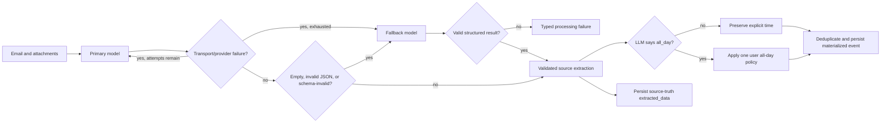

# Calendar Policy, LLM Fallback, and Incremental Evals

**Status:** Implemented (WS1–WS7 landed on `feat/calendar-policy-plan`; Stage A/B full spend provisional — see eval recommendation report)
**Date:** 2026-07-22
**Scope:** Supabase calendar preferences; backend event materialization and LLM
routing; web, iOS, and Android settings/review UI; production-derived eval
fixtures; model registry and eval infrastructure.

This plan follows from the production investigation for `toni@melisma.net`.
The Water Day messages were interpreted correctly: the source describes
date-based, all-day events. The product problem is that an all-day calendar
block is not necessarily how a user wants Selko to *materialize* such source
truth. The LLM must continue to return `all_day: true`; a single global user
preference decides whether Selko keeps the all-day event or turns it into a
timed block.

The same investigation found a separate reliability problem. A provider can be
temporarily unresponsive or can return an empty/malformed structured response.
Selko currently retries only selected provider exceptions and declares the LLM
call successful before extraction JSON has been parsed. The desired behavior is
bounded primary retries followed by a different model, with malformed output
going directly to the fallback.

Finally, the eval runner has the right broad caching idea but does not yet have
a complete invocation identity. It can rerun unrelated operations after one
prompt changes, fail to rerun when attachment bytes or effective API settings
change, and silently mix incompatible result populations in reports. The eval
work below makes inference results content-addressed and immutable so an
identical prompt/model/thinking/settings/fixture invocation is never purchased
twice.

---

## Product decisions (locked)

1. **The LLM owns source truth, not display policy.** If a message describes an
   event by date and gives no meaningful start/end time, the extraction remains
   `all_day: true`. Do not teach the prompt that Water Day, a school closure, or
   a deadline is secretly a timed event.
2. **There is one global all-day materialization preference.** It applies to
   every newly extracted `all_day: true` event, without semantic subtypes or
   event-by-event classification:
   - All day
   - 9:00 AM–5:00 PM
   - 8:00 AM–9:00 AM
   - Custom start/end
3. **Explicitly timed events are untouched.** The preference never changes an
   event for which the source supplied a meaningful time and the LLM returned
   `all_day: false`.
4. **A settings change applies prospectively.** It affects proposals created
   afterward. It does not silently rewrite pending, approved, or synced events.
   A separate explicit “apply to pending events” action can be designed later
   if users ask for it.
5. **Fallback is for operational or protocol failure.** Selko does not ask a
   second model to vote on a valid primary answer.
6. **Primary retry behavior is fixed and bounded.**
   - Initial primary call plus two retries for unresponsive/transient failures.
   - Empty output, invalid JSON, schema echo, truncation, or schema validation
     failure skips the remaining primary retries and calls the fallback
     immediately.
   - After primary transient retries are exhausted, call the fallback.
   - The fallback gets one call plus one retry only for a transient failure.
7. **Use a different provider for fallback in production.** This avoids a
   provider-wide outage defeating both routes. The actual primary/fallback pair
   is selected from the eval report, not hard-coded by this plan.
8. **Prefer a little reasoning.** Evaluate each current model at its lowest
   genuine reasoning level (`minimal`, `low`, or the provider’s least-expensive
   enabled mode). Do not run every model at every thinking level. A no-thinking
   control is allowed only where an API cannot combine structured output and
   thinking and the comparison is required to diagnose that limitation.
9. **Keep only current candidate models.** Remove old registry/eval entries
   rather than carrying compatibility baggage. In particular: no MiniMax M2.5,
   Claude Fable, GPT-5.6 Sol, Grok 4.3, old Qwen 3/3.5/VL families, old Gemini
   preview IDs, or old DeepSeek chat/reasoner IDs.
10. **Production LLM failures become anonymized fixtures.** Infrastructure and
    persistence failures become deterministic unit/integration tests instead;
    they are not mislabeled as model-quality evals.
11. **Review-card descriptions expand inline.** Use “Show more / Show less,”
    not hover-only tooltips. Expansion must work with touch, keyboard,
    screen readers, and Dynamic Type.

---

## Current-state findings

### Production Water Day result

The two Water Day suggestions were correctly extracted as date-only all-day
events. Prompting the LLM to invent 9–5 would discard source fidelity and would
make different models guess different policy. The conversion belongs after
validated extraction and before event deduplication/persistence.

### Production failure inventory

The inspected failed rows fell into distinct classes:

| Failure class | Observed shape | Correct treatment |
|---|---:|---|
| Supabase/transport resource exhaustion | 60 rows, `Errno 11: Resource temporarily unavailable` | Connection/concurrency fix plus fault-injection tests; never a model fallback or eval fixture |
| Legacy missing email date | 14 rows with `email_date=None` | Regression unit test around date fallback/validation; add an extraction fixture only if the message itself exposed a model ambiguity |
| Schema echo | 2 model responses | Source email becomes an anonymized extraction fixture; response is classified malformed and routed directly to fallback |
| Empty/invalid JSON | 2 model responses | Source email becomes an anonymized extraction fixture; route directly to fallback |
| Duplicate `event_sources` insert | 2 unique-constraint failures | Idempotent persistence test/fix; never a model fallback |
| Stale `processing` rows | 30 rows | Worker lock recovery/observability test; never a model fallback |

The implementation must preserve these boundaries. Retrying another model
cannot repair a database connection pool, worker lease, or unique constraint.

### Existing code boundaries

- `backend/selko/services/event_processing.py` builds extraction prompts and
  parses structured output.
- `backend/selko/services/llm_gateway.py` owns call attempts and call logging,
  but parsing currently happens after the gateway has logged success.
- `backend/selko/services/llm_provider.py` owns provider adapters and the model
  registry. Its generic thinking vocabulary is too coarse for current APIs.
- `backend/selko/services/events.py` normalizes, deduplicates, creates events,
  and writes `event_sources.extracted_data`.
- `supabase/migrations/20260126000005_create_user_calendar_settings.sql`
  established the existing per-user calendar preference row.
- `frontend/src/lib/services/calendar-settings.js`, iOS
  `CalendarSettingsService.swift`, and Android
  `CalendarSettingsRepository.kt` already read/write that row.
- Descriptions are currently capped at two lines in web `EventCard.svelte`,
  iOS `EventCardView.swift`, and Android `EventCardContent.kt`.
- `backend/tests/eval/run_eval.py` hashes the fixture JSON but not referenced
  attachment bytes, uses one combined extraction/compare/merge prompt hash,
  and uses result paths that omit effective request settings.

---

## Architecture



The source record and materialized event intentionally differ when a user has
chosen a timed all-day policy:

| Field | `event_sources.extracted_data` | `events` row |
|---|---|---|
| `all_day` | `true` | `false` for timed modes |
| start/end | Canonical date-based extraction | User-timezone timed window |
| purpose | Auditable source truth and future reprocessing | What review UI and calendar sync display |

This split makes the transformation deterministic, reversible from retained
evidence, and independent of model behavior.

---

## WS1 — Global all-day materialization preference

### Database

Add a migration:

`supabase/migrations/<timestamp>_add_all_day_materialization_preference.sql`

Add these columns to `public.user_calendar_settings`:

```sql
all_day_display_mode text NOT NULL DEFAULT 'all_day'
    CHECK (all_day_display_mode IN (
        'all_day',
        'day_9_to_5',
        'morning_8_to_9',
        'custom'
    )),
all_day_custom_start time,
all_day_custom_end time
```

Add a table constraint:

- Custom mode requires both custom times.
- Custom end must be later than custom start.
- Non-custom rows may leave the custom columns null. Preserve saved custom
  values when switching presets so returning to Custom restores the last input.

No backfill is needed beyond the `all_day` default.

### Backend policy object

Add `backend/selko/services/calendar_policy.py`:

```python
class AllDayDisplayMode(StrEnum):
    ALL_DAY = "all_day"
    DAY_9_TO_5 = "day_9_to_5"
    MORNING_8_TO_9 = "morning_8_to_9"
    CUSTOM = "custom"

@dataclass(frozen=True)
class AllDayPolicy:
    mode: AllDayDisplayMode
    custom_start: time | None = None
    custom_end: time | None = None

def materialize_all_day_event(
    source_event: dict[str, Any],
    policy: AllDayPolicy,
    timezone_name: str,
) -> dict[str, Any]:
    ...
```

Rules:

1. Return an independent copy; never mutate the source extraction.
2. If `all_day` is false, return the event unchanged.
3. `all_day` mode returns the event unchanged.
4. Preset/custom modes:
   - Interpret the LLM’s start/end as civil dates in the user’s IANA timezone,
     never as UTC dates.
   - Set `all_day=false`.
   - For a one-day all-day event, use the chosen start and end on that civil
     day.
   - All-day end dates are exclusive. For a multi-day event, start at the
     chosen time on the first covered day and end at the chosen end time on the
     last covered day (`exclusive_end_date - 1 day`). Do not fan one source
     event out into daily child events.
   - If the source lacks an end, treat it as one covered day.
   - Construct timezone-aware datetimes with the existing civil-time helpers so
     daylight-saving transitions are correct.
5. An invalid custom policy is a settings validation error. It must not cause
   an LLM retry or silently fall back to arbitrary times. Database defaults
   guarantee `all_day` for missing settings.

### Placement in the event pipeline

In `backend/selko/services/events.py`:

1. Normalize the validated LLM event into `source_event_data`.
2. Load calendar settings and timezone once per processed email, outside the
   event loop.
3. Produce `materialized_event_data =
   materialize_all_day_event(source_event_data, policy, timezone)`.
4. Use the materialized data for candidate lookup/dedup and the `events` row.
5. Pass both forms to `create_event` (or introduce a small value object) so
   `event_sources.extracted_data` receives source data and `events` receives
   materialized data.

Do not apply this policy inside the Google Calendar adapter. Applying it before
dedup means the review UI, dedup logic, and eventual synced event all see the
same event.

### Settings UI on all platforms

Add a “Date-only events” control under Calendar settings:

> When an email gives a date but no time, add it as:

- All day
- 9:00 AM–5:00 PM
- 8:00 AM–9:00 AM
- Custom…

For Custom, reveal native start/end time controls and an inline error when end
is not later than start. Show a concise preview using the device locale, e.g.
“Example: Water Day · Mon, Jul 27 · 9:00 AM–5:00 PM.”

Implementation surfaces:

- Web: `frontend/src/routes/app/settings/+page.svelte`,
  `frontend/src/lib/services/calendar-settings.js`, translations, and page
  tests.
- iOS: `SettingsViewModel.swift`, `CalendarSettingsService.swift`, Settings
  view, localized strings, and tests.
- Android: `CalendarSettingsRepository.kt`, `SettingsViewModel.kt`,
  `SettingsScreen.kt`, string resources, and tests.

All clients write the same enum values. Do not replicate time conversion logic
in clients.

### All-day tests

- Unit tests for every mode, missing end, multi-day exclusive end, and DST
  boundaries.
- A regression test using the anonymized Water Day fixture must assert that
  extraction still returns `all_day=true`.
- Separate event-service tests assert that the same extraction materializes as
  all-day, 9–5, 8–9, and a custom window.
- Explicitly timed event remains byte-for-byte unchanged under every policy.
- Source `extracted_data` remains all-day while the event row is timed.
- Dedup receives the materialized representation.
- Settings round-trip and invalid custom time tests on all three clients.

---

## WS2 — Expandable calendar descriptions

### Chosen interaction

Use inline progressive disclosure:

- Collapsed: three lines (two is too little for calendar context).
- Show `Show more` only when text actually overflows.
- Expanded: render the entire description and a `Show less` action.
- Expansion is local presentation state keyed by event ID. It is not persisted.
- Reset the key when an event leaves the list; do not let recycled native list
  cells inherit another card’s state.
- Card-level tap/navigation remains intact. The expansion button must stop the
  card navigation gesture/click.
- Announce expanded/collapsed state with `aria-expanded` on web and the native
  accessibility equivalents.

Why not a tooltip: hover has no mobile equivalent, tooltips are poor for long
formatted text, and they are easy to miss with keyboard or assistive
technology. The existing detail/edit screen remains another route to the full
description, but it should not be required merely to read a card.

### Platform files

- Web: `frontend/src/lib/components/EventCard.svelte`. Use a measured overflow
  action (line-clamp plus `scrollHeight > clientHeight` after layout), not a
  character-count guess. Re-measure on width/text changes.
- iOS: `ios/Selko/Features/Review/Views/EventCardView.swift`. Use a collapsed
  `lineLimit(3)`, an expansion binding/state keyed by event ID, and a layout
  measurement that determines whether the unconstrained text is taller than
  the collapsed text.
- Android:
  `android/app/src/main/java/net/melisma/selko/ui/screens/review/EventCardContent.kt`.
  Use `TextLayoutResult.hasVisualOverflow`, `maxLines = 3` when collapsed, and
  remembered saveable state keyed by event ID.

Preserve line breaks. Long URLs may wrap but must not force horizontal overflow.

### Description tests

- Short text has no disclosure control.
- Long text initially shows three lines and can reveal the full exact string.
- “Show less” restores the collapsed layout.
- Expanding does not navigate/open the card.
- Expansion state does not transfer to another event after list updates.
- Accessibility label/state tests where supported.
- Run the required web/iOS/Android screenshots because all three UIs change.

---

## WS3 — Validated primary/fallback routing

### Configuration

Add non-secret configuration:

```dotenv
LLM_PROVIDER=<primary provider>
LLM_MODEL=<primary model>
LLM_THINKING=low

LLM_FALLBACK_PROVIDER=<different provider>
LLM_FALLBACK_MODEL=<fallback model>
LLM_FALLBACK_THINKING=low

LLM_PRIMARY_MAX_ATTEMPTS=3
LLM_FALLBACK_MAX_ATTEMPTS=2
```

Update `backend/selko/config.py`, `.env.example`, deployment docs, and
`docs/llm-integration.md`. The provider-specific API keys remain separate.
Fallback is disabled only when its provider/model/key is absent, with a loud
startup warning in non-test environments.

Do not expose model choice as an end-user setting.

### Route and validation API

Refactor `backend/selko/services/llm_gateway.py` around:

```python
@dataclass(frozen=True)
class LLMRoute:
    role: Literal["primary", "fallback"]
    provider: LLMProvider
    max_attempts: int

class LLMFailureKind(StrEnum):
    TRANSIENT = "transient"
    EMPTY = "empty"
    INVALID_JSON = "invalid_json"
    INVALID_SCHEMA = "invalid_schema"
    TRUNCATED = "truncated"
    PERMANENT_PROVIDER = "permanent_provider"

def call_validated[T](
    self,
    operation: str,
    content: list[ContentPart],
    validator: Callable[[LLMResponse], T],
) -> T:
    ...
```

`event_processing.py` supplies operation-specific validators that strip only
documented code fences, parse JSON exactly once, reject schema echoes, and run
Pydantic validation. The gateway controls routing because it can only make the
correct immediate-fallback decision after validation.

Keep `call()` temporarily for genuinely unstructured operations, but all
calendar extraction/compare/merge operations must use `call_validated`.

### Failure routing table

| Primary outcome | Retry primary? | Call fallback? |
|---|---:|---:|
| Timeout, connection reset, 408, 429, retryable 5xx/provider overloaded | Yes, up to 3 total attempts | After exhaustion |
| Empty/whitespace response | No | Immediately |
| Invalid JSON or schema echo | No | Immediately |
| Pydantic/schema validation failure | No | Immediately |
| Truncated/max-token finish reason | No | Immediately |
| Authentication, invalid request, unsupported media/model | No | No; configuration/permanent failure |
| Valid structured response | No | No |
| Database/persistence failure after validation | No | No |

Use exponential backoff with jitter for transient attempts. Respect
`Retry-After` when supplied. Backoff occurs in the gateway; the worker’s
job-level retry remains a second, slower recovery layer.

### Logging

One logical LLM operation gets a correlation ID and one row per physical
attempt (or a parent row plus attempt rows if the existing schema is easier to
extend). Record:

- operation and route role (`primary`/`fallback`)
- provider, model, and normalized thinking configuration
- attempt number and maximum
- start/end/latency
- token usage and cost when returned
- failure kind and sanitized provider status
- finish reason
- whether this attempt supplied the accepted result

Do not log raw secrets or full private email content. Crucially, an HTTP-success
response that fails parsing/validation is logged as a failed attempt, correcting
the current false-success behavior.

### Fallback tests

Use deterministic fake providers:

- Primary transient, transient, success: exactly three primary calls, no
  fallback.
- Primary transient three times: three primary calls, then fallback.
- Primary empty/invalid/schema-invalid/truncated on first call: one primary
  call, then fallback immediately.
- Primary valid: exactly one primary call.
- Primary permanent/configuration error: no retry and no fallback.
- Fallback transient then success: at most two fallback calls.
- Both routes fail: typed error retains both attempt histories.
- Persistence exception after valid extraction never calls fallback.

---

## WS4 — Current model/provider registry

### Registry shape

Replace ad hoc booleans such as `reasoning=True` and the shared
`none|low|medium` vocabulary with explicit provider capabilities:

```python
@dataclass(frozen=True)
class ThinkingConfig:
    mode: Literal["effort", "level", "toggle", "budget", "provider_default"]
    value: str | int | bool

@dataclass(frozen=True)
class ModelSpec:
    provider: str
    model: str
    vision: bool
    structured_output: Literal["json_schema", "json_object", "prompt_json"]
    preferred_thinking: ThinkingConfig
    supported_thinking: tuple[ThinkingConfig, ...]
    request_api: str
    pricing: Pricing | None
    pricing_as_of: date | None
```

Adapters must serialize the explicit setting. Omitting a field is not equivalent
to “none” or “low”: for example, GPT-5.6 omission defaults to medium, and
Gemini 3.x models cannot disable thinking. Each eval result stores the
*effective serialized request settings*, not only the CLI label.

Before implementation, query each authenticated provider’s model-list endpoint
and copy the exact accepted IDs into the registry. Documentation names below
are product-family names, not permission to guess API IDs.

### Curated initial eval matrix

Use one low-reasoning configuration per current model. This is a screening
matrix, not a permanent promise to support every provider:

| Provider | Current candidate | Eval thinking | Notes |
|---|---|---|---|
| OpenAI | GPT-5.6 Luna | `low` | High-volume candidate; send `reasoning_effort=low` explicitly |
| OpenAI | GPT-5.6 Terra | `low` | Higher-quality candidate; no Sol |
| Google | Gemini 3.5 Flash-Lite | `minimal` | Lowest supported 3.x level |
| Google | Gemini 3.6 Flash | `minimal` | Add `low` only if minimal has semantic misses, not by default |
| Alibaba | Qwen 3.6 Flash | smallest supported thinking budget | Current cost candidate |
| Alibaba | Qwen 3.7 Plus | smallest supported thinking budget | Required quality candidate; confirm structured-output compatibility while thinking |
| Z.AI | GLM-5.2 | thinking enabled at its least expensive supported setting | Current requested model; use JSON mode if the authenticated endpoint supports it |
| Moonshot | Kimi K3 | `low` | No older K2.x models |
| MiniMax | MiniMax M3 | least/deferred reasoning supported by current API | No M2.5/M2.7 maintenance |
| DeepSeek | DeepSeek V4 Flash | lowest reasoning setting | No old `deepseek-chat`/`deepseek-reasoner` IDs |
| xAI | Grok 4.5 | `low` | No Grok 4.3; keep newer beta IDs out of the default matrix unless documented stable |
| Anthropic | Claude Sonnet 5 | adaptive `low` | No Fable; omit Opus unless the first report shows a quality ceiling |
| Meta | Spark 1.1 | lowest supported reasoning setting | Add the provider adapter only after authenticated model/capability verification |
| Thinking Machines | Inkling | `low` | Tinker Anthropic-compatible API supports explicit effort |

Do not run a Cartesian product of models and thinking levels. If a model fails
because its low-thinking mode is incompatible with structured output, record
that as a capability result. Run one disabled/non-thinking diagnostic only for
that model to distinguish “bad model” from “unsupported setting,” then state
the exception in the report.

### Research basis (verify again at implementation time)

- [OpenAI GPT-5.6 model guidance](https://developers.openai.com/api/docs/guides/model-guidance?model=gpt-5.6)
  lists Terra as the balanced model, Luna for high-volume efficiency, and
  supports explicit reasoning effort from none through max. This plan uses low.
- [Gemini thinking](https://ai.google.dev/gemini-api/docs/thinking) documents
  `minimal|low|medium|high` for Gemini 3.x, with Flash and Flash-Lite defaults
  above or at the low end; thinking cannot be fully disabled.
- [Qwen thinking](https://www.alibabacloud.com/help/en/model-studio/deep-thinking)
  documents the hybrid thinking switch/budget, while the
  [Qwen vision/model table](https://www.alibabacloud.com/help/en/model-studio/vision-model)
  must be checked for the exact structured-output limitation of each current
  ID.
- [Z.AI thinking mode](https://docs.z.ai/guides/capabilities/thinking-mode)
  exposes enabled/disabled thinking, and
  [structured output](https://docs.z.ai/guides/capabilities/struct-output)
  exposes JSON mode.
- [xAI reasoning effort](https://docs.x.ai/developers/model-capabilities/text/reasoning)
  documents low/medium/high effort for current Grok reasoning models.
- [Thinking Machines’ Anthropic-compatible API](https://tinker-docs.thinkingmachines.ai/tinker/compatible-apis/anthropic/)
  documents Inkling effort controls.
- [MiniMax prompting guidance](https://platform.minimax.io/docs/token-plan/prompting-best-practices)
  recommends direct/no-deep-analysis instructions for extraction; confirm the
  current M3 API’s actual control field before adapter implementation.
- Provider model catalogs and pricing change quickly. Store a
  `pricing_as_of` date and report unknown pricing as unknown, never as zero.

### Secret/config work

The deleted `.env2` contained credentials that must not enter git. Add only
variable *names* to `.env.example` and deployment configuration:

- `XAI_API_KEY`
- `META_API_KEY` (use the provider’s actual documented name if different)
- `TINKER_API_KEY`
- plus existing OpenAI, Anthropic, Gemini, Alibaba, Moonshot, Z.AI, DeepSeek,
  and MiniMax variables.

Audit staging/production secret presence separately. Never print values in
scripts, CI logs, plan output, or reports.

---

## WS5 — Truly incremental, immutable evals

### The identity contract

Separate the cost-bearing model inference from deterministic scoring.

```python
@dataclass(frozen=True)
class InferenceIdentity:
    identity_version: int
    operation: str
    provider: str
    model: str
    thinking: dict[str, Any]       # normalized effective config
    request_settings: dict[str, Any]
    prompt_contract_hash: str
    adapter_contract_hash: str
    fixture_input_hash: str

@dataclass(frozen=True)
class ScoreIdentity:
    scoring_version: int
    inference_key: str
    expected_output_hash: str
    scorer_hash: str
```

Canonicalize dictionaries with sorted keys and compact JSON separators, then:

```text
inference_key = sha256(canonical_json(InferenceIdentity))
score_key = sha256(canonical_json(ScoreIdentity))
```

An existing complete artifact at an `inference_key` is immutable and is always
a cache hit. A normal eval command has no overwrite path.

### What each hash contains

`fixture_input_hash`:

- Input portion of the fixture JSON only (email subject/body/date/sender and
  operation inputs).
- Raw bytes and relative names of every referenced attachment, in stable order.
- Any deterministic pre-model conversion artifact or its conversion contract
  hash.
- Exclude handwritten expected output. Editing expectations must rescore, not
  call a model.

`prompt_contract_hash`:

- Only the selected operation’s prompt builder and literal templates.
- That operation’s response schema and serialized JSON schema.
- System/developer prompt content.
- Prompt renderer version.
- Do not combine extraction, compare, and merge in one hash.

`adapter_contract_hash`:

- Provider request builder for that route.
- Structured-output/schema sanitizer.
- attachment/media conversion code relevant to that provider.
- response text extraction/normalization code.
- Use source-content hashes, not Git commit SHA. An unrelated repository commit
  must not invalidate inference.

`request_settings`:

- API surface/base URL identity (never a key or secret).
- temperature, top-p, max output tokens, response format, safety options,
  timeout, and any provider-specific knobs.
- Exact serialized thinking level/effort/budget/toggle.
- SDK behavior version where it can change wire serialization.

Also record the Git commit and full working-tree code hash as provenance, but do
not put unrelated global code hashes in the inference identity.

### Storage

```text
backend/tests/eval/results/
  inference/<first-two-key-chars>/<inference_key>.json
  scores/<first-two-key-chars>/<score_key>.json
  manifests/<run_id>.json
  reports/<date>-<slug>.md
```

An inference artifact stores identity, raw/sanitized response, parsed output,
attempt metadata, token counts, latency, cost, and timestamps. A score artifact
stores only deterministic scoring output and its identity. A run manifest
lists the requested matrix/corpus and HIT/MISS/ERROR state for every cell.

Write through a temporary file and atomic rename. With parallel workers, use a
per-key lock so two processes cannot buy the same missing inference. If an
abandoned temp/lease is recovered, verify that no complete canonical artifact
exists before calling the provider.

### Incremental behavior

| Change | Model calls |
|---|---|
| Add one fixture | Only that fixture for requested model configurations |
| Edit one fixture input/body | Only that fixture for requested configurations |
| Replace one referenced attachment | Only fixtures referencing it |
| Edit expected output only | Zero; rescore existing inference |
| Edit extraction prompt/schema | Extraction fixtures only |
| Edit compare prompt/schema | Compare fixtures only |
| Change one model’s low-thinking budget | That model/configuration only |
| Change scorer/tolerances | Zero; rescore |
| Change unrelated backend/UI code | Zero |
| Re-run identical command | Zero |

Add `--plan` to print the requested cells and cache reasons without making API
calls. Normal execution runs only MISS cells. Replace the ordinary
`--no-cache` behavior with explicit `--replicate N`; replicas are separate
artifacts for intentional nondeterminism studies and never overwrite the
canonical result.

### Reporting correctness

Remove “latest modified result” fallback behavior. A report is built from one
explicit run manifest:

- Show missing/error cells instead of silently substituting older hashes.
- Show pass numerator and eligible denominator for every model.
- Compare models head-to-head only on their shared fixture set; show coverage.
- Keep malformed/protocol failure rate separate from semantic score.
- Include provider/model/exact thinking settings, request settings hash, prompt
  hash, fixture corpus hash, fixture count, scorer hash, and code provenance.
- Unknown token counts/prices stay `unknown`; they do not become `$0`.

### Legacy results

Build a one-time read-only importer. Reuse an old inference only when every
identity component can be reconstructed. Otherwise label it `legacy,
non-cacheable`; retain it for historical reports but never allow it to suppress
a new model call.

### Eval-runner tests

- Canonical identity is stable across dict order and processes.
- Attachment-byte changes invalidate only dependent fixtures.
- Expected-only changes create a new score and no inference call.
- Operation prompt changes do not invalidate other operations.
- Thinking budget and effective serialized setting affect identity.
- Unrelated code changes do not affect identity.
- Same key under concurrency produces one provider call.
- Complete artifacts cannot be overwritten.
- Reports never mix prompt/settings/corpus identities.
- `--plan` reports exact HIT/MISS reasons and performs zero provider calls.

---

## WS6 — Production-derived fixtures

Create anonymized fixtures under `backend/tests/eval/fixtures/` with
hand-written expected output:

1. Water Day source email(s): expected events remain `all_day=true` on the two
   dates. The global policy is tested outside the LLM expected output.
2. Each source email that produced schema echo.
3. Each source email that produced empty or invalid JSON.
4. Any currently reproducible semantic extraction miss found while reviewing
   the remaining production failures.

Fixture procedure:

1. Export only the specific source message and necessary attachment bytes.
2. Replace names, email addresses, account IDs, message IDs, organizations, and
   unrelated personal details consistently.
3. Preserve the structural features that triggered the failure: HTML layout,
   date wording, forwarded-message boundaries, attachment type, and ambiguity.
4. Hand-write expected output from the email evidence. Never derive expected
   output from the current model response.
5. Add a short provenance field containing failure class and anonymization
   notes, but no production identifiers.
6. Run the fixture through the selected matrix. Once committed, future
   identical cells are cache hits.

Do **not** create LLM fixtures for `Errno 11`, duplicate database inserts, stale
worker locks, or other post-inference failures. Add focused regression tests:

- bounded worker/database concurrency and connection release
- stale lease recovery
- idempotent `event_sources` insert/upsert behavior
- missing `email_date` deterministic fallback/error classification

---

## WS7 — Small benchmark, decision report, and production recommendation

The implementation increment is not complete after building the runner. It
must run the evals and return a recommendation.

### Stage A — Capability smoke

Run every curated model configuration against three representative extraction
fixtures:

1. plain-text timed event
2. multimodal/attachment date event
3. no-event email

This catches invalid model IDs, unsupported reasoning/structured-output
combinations, adapter errors, and missing modality support cheaply. Fix adapter
bugs and rerun only MISS cells. A provider/configuration that cannot pass the
protocol smoke is excluded with a documented reason.

### Stage B — Full extraction corpus

Run every Stage A survivor, at its one preferred low-reasoning configuration,
against the full extraction corpus including the new production fixtures. The
content-addressed cache ensures existing identical cells are not rerun and newly
added fixtures are the only calls on later runs.

### Stage C — Finalists only

Choose at most three finalists from Stage B. Run those configurations through:

- compare/dedup fixtures
- merge/update fixtures
- thread scenarios

Do not expand thinking modes by default. A single alternate mode is justified
only by a named Stage A/B failure hypothesis.

### Decision metrics

Report:

- exact-match/core-field pass rate and shared-fixture head-to-head
- false-positive rate on no-event messages
- all-day/date accuracy
- malformed/empty/schema-invalid rate
- attachment fixture coverage and pass rate
- p50/p95 latency
- input/output/reasoning tokens where available
- measured cost per processed email and monthly tier projections
- provider availability/errors observed during the run

Selection rules:

- Primary: best quality/reliability tradeoff among low-reasoning configurations,
  not simply the cheapest model.
- Fallback: strongest structured-output reliability and semantic quality from a
  *different provider*. Cost is secondary because fallback traffic should be
  rare.
- A fallback candidate with protocol failures on the new malformed-response
  regression set is ineligible.
- Prefer a smaller/faster primary only if its shared-corpus quality is within
  the report’s predeclared tolerance of the best model.

### Required report

Generate:

`backend/tests/eval/reports/<date>-current-model-low-thinking-recommendation.md`

It must state:

1. The exact matrix actually run and every exclusion.
2. Cache hits, misses, new calls, and estimated/measured spend.
3. Results on the newly added production fixtures.
4. Recommended primary provider/model/thinking setting.
5. Recommended fallback provider/model/thinking setting.
6. The exact retry policy: primary 3 total attempts; immediate fallback for
   malformed output; fallback 2 total transient attempts.
7. Known limitations and the evidence that would justify testing another
   thinking level later.
8. Exact environment/deployment configuration to adopt, without secret values.

The developer handoff to the user must summarize this report and make a clear
recommendation. Do not stop at “more testing is needed” unless all candidate
providers are genuinely unavailable.

---

## Implementation sequence

This work spans several independently reviewable increments. Follow the
repository worktree/PR workflow for each source-code increment.

1. **Eval identity and tests**
   - Implement immutable inference/scoring identities, atomic storage,
     operation-specific hashes, `--plan`, manifests, and report isolation.
   - This must land before buying the new benchmark so subsequent calls are
     reusable.
2. **Registry/adapters**
   - Verify authenticated model IDs.
   - Replace the old registry with current candidates and explicit thinking
     capabilities.
   - Add xAI, Meta, and Tinker adapters/configuration as supported by their
     current endpoints.
   - Add adapter serialization tests.
3. **Production fixtures**
   - Add the anonymized Water Day and malformed-output source messages with
     hand-written expected output.
   - Add non-LLM regression tests for infrastructure/persistence failures.
4. **Run Stage A and Stage B**
   - Use one low/minimal configuration per model.
   - Commit the manifest/results/report artifacts according to the existing eval
     artifact policy.
5. **Run Stage C and choose routes**
   - Benchmark at most three finalists on compare/merge/thread operations.
   - Finalize primary/fallback model IDs from evidence.
6. **Fallback routing**
   - Implement `call_validated`, typed failure classification, attempt logging,
     and selected production route configuration.
7. **All-day policy**
   - Add migration, backend materialization, source/materialized separation,
     and three-platform settings.
8. **Expandable descriptions**
   - Implement and visually verify the three platform cards.
9. **Final scoped verification**
   - Backend unit suite for backend/migration changes.
   - Frontend unit tests, `npm run check`, and web screenshots.
   - iOS tests and screenshots.
   - Android tests and screenshots.
   - Run `--plan` for the final eval manifest and confirm every expected cell is
     HIT with zero unintended provider calls.
10. **Documentation**
    - Update `docs/llm-integration.md`, `docs/evals-process.md`,
      `backend/tests/eval/README.md`, `docs/database-schema.md`, and `CLAUDE.md`
      for the shipped architecture and model list.

---

## Acceptance criteria

- Water Day extraction remains `all_day=true` in its golden fixture.
- One user setting governs all extracted all-day events with the four requested
  choices; there are no semantic all-day categories.
- Timed modes use the user’s civil timezone and preserve source truth in
  `event_sources`.
- Existing and synced events are not retroactively rewritten.
- All three Settings surfaces round-trip the same preference.
- Long card descriptions can be expanded fully on web, iOS, and Android without
  hover.
- Primary unresponsiveness follows 3 total attempts, then fallback.
- Malformed primary output invokes fallback after exactly one primary attempt.
- Database/worker failures never invoke another model.
- Every eval inference is keyed by operation, model, exact thinking, effective
  request settings, prompt/adapter contract, fixture input, and attachment
  bytes.
- Repeating an identical eval issues zero model calls.
- Adding one fixture runs only that fixture across the requested matrix.
- Editing expected output or scorer code issues zero model calls.
- The default matrix contains current models only and uses one low/minimal
  thinking configuration per model.
- The completed implementation runs the benchmark and produces a report with a
  concrete primary/fallback recommendation.

---

## Out of scope

- LLM-generated semantic classes for different kinds of all-day events.
- Per-event or per-sender all-day policy.
- Automatic retroactive conversion of existing calendar events.
- Model voting, ensemble merging, or a second model judging valid output.
- Running every model at every thinking level.
- Keeping old model IDs for historical convenience.
- Treating database/worker failures as LLM eval failures.

