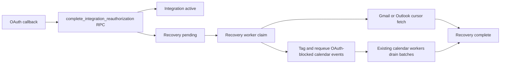

# OAuth Reconnect Catch-Up

**Status:** Partially delivered by polling email ingestion v2; Calendar scope
still planned.

The **email half is done**. The `integrations_ensure_email_sync_state` trigger
(migration `20260802000002`) fires whenever an integration becomes active, so a
reconnect immediately sets `next_poll_at = now()` and clears the accumulated
`consecutive_failures` backoff. The coordinator then picks the integration up on
its next tick and resumes from the durable provider cursors, which is precisely
the "fresh cursor-driven fetch, not a task replay" unit of recovery this
document argues for. No OAuth callback work is needed.

The **Calendar half is still outstanding**: distinguishing expired OAuth from
validation, quota or provider failures in `sync_error`/`dead_letter_reason`, and
making provider circuit breakers per-user instead of global.

Note the current-state diagnosis below is now out of date where it describes
`schedule_email_fetches()` and deduplicated `email_fetch` tasks — that path was
removed in PR #234. Read it as the historical motivation, not the present code.

## Outcome

Reauthorizing Gmail, Outlook, or Google Calendar must do more than replace an
expired token. It must durably schedule the work that could not run while the
connection was unavailable, drain that work through the existing background
workers, and show progress without making the OAuth callback wait.

This is a recovery workflow, not a blanket replay:

- Gmail and Outlook resume from their durable provider cursors.
- Google Calendar retries only work blocked by that user's expired Calendar
  authorization.
- Failed LLM parsing is not caused by OAuth and is never silently mixed into
  reconnect recovery. Production parsing failures continue to become anonymized
  eval fixtures and are reprocessed explicitly.

## Current-state diagnosis

The application is an asynchronous monolith backed by PostgreSQL status queues:

- `google_oauth_callback()` and `microsoft_oauth_callback()` save credentials
  and redirect immediately. They do not create durable recovery work.
- `schedule_email_fetches()` runs periodically and creates one deduplicated
  `email_fetch` task per active email integration. A reconnect can therefore
  wait for the next scheduler interval.
- Gmail History and Outlook delta cursors already provide idempotent catch-up.
  Replaying a failed scheduled task is unnecessary; a fresh cursor-driven fetch
  is the correct unit of recovery.
- Calendar workers claim `approved` events. Exhausted attempts become
  `sync_failed`, but `sync_error` and `dead_letter_reason` are free text, so the
  system cannot safely distinguish expired OAuth from validation, quota, or
  provider failures.
- Provider circuit breakers are global by service name. A user's invalid token
  currently counts like a provider outage and can pause unrelated users.

The existing database-as-queue architecture is sufficient. An external broker
or a synchronous reconnect cascade would add operational complexity without
improving the recovery guarantee.

## Product contract

1. OAuth callback latency is independent of backlog size.
2. Saving new credentials and requesting recovery are one atomic database
   transaction.
3. Repeated callbacks create at most one active recovery generation per
   integration.
4. Email recovery starts promptly and resumes from the last committed cursor.
   If that cursor has expired, recovery covers the interval since the last
   successful sync rather than silently truncating to the normal 14-day
   initial-import window.
5. Calendar recovery touches only blocked or failed work classified as
   `oauth_required` or `oauth_scope_required` for the reauthorized
   integration's user.
6. Work drains through normal workers in bounded batches.
7. The connection UI distinguishes `Connected` from `Catching up`, and exposes
   a contextual retry if recovery itself fails.
8. A newer reauthorization supersedes an older generation safely.
9. User-auth failures never open a global provider circuit breaker.
10. Recovery is observable and auditable without logging tokens or message
    content.

## Architecture decision

Add a durable `integration_recoveries` command table and an atomic,
service-role-only RPC that upserts credentials and creates a recovery
generation.

Do not add new recovery task types to `scheduled_tasks`. Its schema and claim
path are intentionally scoped to periodic fetches. Recovery is its own durable
state machine and can enqueue the existing `email_fetch` task when appropriate.

## Implementation map

| Area | Primary files |
|---|---|
| Schema/RPCs | `supabase/migrations/<timestamp>_integration_recovery.sql` |
| OAuth persistence | `backend/selko/services/integrations.py`, `backend/selko/api/routes/integrations.py` |
| Email recovery | `backend/selko/workers/email_fetch.py`, `backend/selko/services/scheduled_tasks.py` |
| Calendar classification/requeue | `backend/selko/services/calendars.py`, `backend/selko/services/events.py` |
| Worker orchestration | `backend/selko/workers/pool.py`, `backend/selko/services/circuit_breaker.py` |
| Web | `frontend/src/lib/services/integrations.js`, `frontend/src/lib/components/ConnectionRecovery.svelte` |
| iOS | `ios/Selko/Features/Integrations/Services/IntegrationService.swift`, `ios/Selko/Features/Review/Views/ConnectionRecoveryView.swift` |
| Android | `android/app/src/main/java/net/melisma/selko/data/repository/IntegrationRepository.kt`, `android/app/src/main/java/net/melisma/selko/ui/screens/review/ConnectionRecoveryContent.kt` |

## 1. Add structured failure classification

Add nullable `events.sync_failure_code` with a constrained vocabulary:

- `oauth_required`
- `oauth_scope_required`
- `provider_transient`
- `rate_limited`
- `invalid_event`
- `permission_denied`
- `unknown`

Keep `sync_error` as the user-safe detail and `dead_letter_reason` as the
operator detail. Control flow must use `sync_failure_code`, never string
matching.

Refactor calendar error handling to return a typed classification containing:

- `code`
- `retryable`
- `counts_toward_circuit_breaker`
- `user_message`
- `operator_detail`

A Google 401 or invalid/expired credential:

1. marks that user's `google_calendar` integration `expired`;
2. returns the claimed event to `approved`;
3. sets `sync_failure_code = 'oauth_required'`;
4. clears `next_retry_at`, locks, and dead-letter fields;
5. does not consume further automatic attempts; and
6. does not count toward the global `google_calendar` circuit breaker.

Classify a provider's documented insufficient-scope response as
`oauth_scope_required`, not generic `permission_denied`. Only the former is
eligible for reauthorization recovery; an unrelated 403 remains a terminal
permission failure.

Update `claim_approved_event` so it claims only users with an active Google
Calendar integration. This prevents workers from burning attempts while an
integration is known to be unavailable.

Apply the same failure taxonomy to scheduled email fetches. User-specific auth
failures expire the corresponding integration but do not count against the
global Gmail or Outlook circuit.

## 2. Add the recovery state machine

Create `public.integration_recoveries`:

| Column | Purpose |
|---|---|
| `id uuid` | Recovery generation and primary key |
| `integration_id uuid` | Integration being recovered |
| `user_id uuid` | Ownership and efficient RLS/query scope |
| `provider integration_provider` | Gmail, Outlook, or Google Calendar |
| `reason text` | `initial_connection` or `reauthorization` |
| `status text` | `pending`, `processing`, `waiting`, `completed`, `completed_with_errors`, `failed`, `superseded` |
| `attempts`, `max_attempts` | Bounded recovery retries |
| `next_retry_at` | Backoff without blocking a worker |
| `locked_by`, `locked_until` | Crash-safe worker claim |
| `recovery_since` | Last successful sync boundary for expired-cursor recovery |
| `checkpoint jsonb` | Provider continuation state for a bounded recovery scan |
| `email_fetch_task_id uuid` | Existing scheduled task used for email catch-up |
| `discovered_count` | Candidate work found |
| `requeued_count` | Calendar events returned to the normal queue |
| `completed_count` | Work that reached its expected terminal state |
| `remaining_count` | Current backlog for UI progress |
| `error_code`, `error_detail` | Structured terminal recovery failure |
| timestamps | Requested, started, updated, and completed times |

Add a partial unique index permitting only one `pending`, `processing`, or
`waiting` recovery per integration.

RLS permits users to select their own recovery metadata. Only `service_role`
may insert or update it. Never expose credentials through this table or its
policies.

Add nullable `emails.recovery_id` and `events.recovery_id`, each referencing
the recovery generation with `ON DELETE SET NULL`. They make end-to-end
progress auditable without storing message or event contents in the recovery
row.

Add RPCs:

- `complete_integration_reauthorization(...)`
- `claim_integration_recovery(worker_id, lock_seconds)`
- `unlock_expired_integration_recoveries()`

`complete_integration_reauthorization` must:

1. be executable only by `service_role`;
2. upsert the integration and preserve an existing refresh token when a
   provider omits a replacement;
3. set the integration active;
4. mark an older active recovery `superseded`; and
5. insert the new `pending` generation in the same transaction.

Update `save_oauth_credentials()` and `save_provider_tokens()` to use this RPC.
Both OAuth callbacks remain redirect-fast.

## 3. Add a recovery worker stage

Add recovery claiming ahead of periodic scheduled work in
`WorkerPool._process_any_work()`. A claim performs only bounded orchestration;
provider work still uses existing fetch and calendar workers.

### Gmail and Outlook

1. If an `email_fetch` task for the integration is already processing, set the
   recovery to `waiting` and revisit it after the task's lock window.
2. Otherwise enqueue one existing `email_fetch` task with `recovery_id` in its
   payload. Deduplicate by active recovery generation, not only by user/provider.
3. Run the normal Gmail History or Outlook per-folder delta implementation and
   tag newly discovered email rows with `recovery_id`.
4. When a provider cursor has expired, search from
   `recovery_since - overlap` and drain every page. `recovery_since` is the
   integration's last successful sync time captured when recovery is created.
5. Keep initial connection behavior at 14 days. If there is no prior successful
   sync timestamp during reauthorization, use that fallback and report that the
   earlier interval could not be proven recovered.
6. Bound work per worker claim and persist continuation state in `checkpoint`.
   Do not commit the replacement provider cursor until the complete recovery
   scan succeeds. If a provider page token becomes invalid, restart the
   idempotent overlap scan.
7. After fetching completes, remain `waiting` while tagged emails are `pending`
   or `processing`. Finish only after they reach `processed`, `skipped`, or
   `failed`.
8. On transient failure, return recovery to `pending` with bounded exponential
   backoff. On another auth failure, mark it failed with `oauth_required` and
   leave the integration expired.

Do not replay the old failed task. The current cursor is the authoritative
resume point.

### Google Calendar

Process at most 100 events per recovery batch:

1. Tag `approved` events currently blocked by the inactive integration with
   `recovery_id`.
2. Select `sync_failed` rows for the same user where `sync_failure_code` is
   `oauth_required` or `oauth_scope_required`.
3. Reset those rows to `approved`, set `sync_attempts = 0`, make them immediately
   eligible, clear locks and dead-letter fields, and attach `recovery_id`.
4. Leave quota, validation, permission, unknown, and non-Calendar failures
   untouched.
5. Recompute recovery counters and return the recovery to `pending` until every
   batch is tagged/requeued.
6. While tagged events are `approved` or `syncing`, keep recovery `waiting`.
7. Finish as `completed` when all tagged events sync, or
   `completed_with_errors` when any reaches a new non-OAuth terminal failure.

Calendar insertion remains idempotent through the existing private
`selko_event_id` reconciliation before insert.

## 4. UI behavior

Extend integration metadata queries on web, iOS, and Android with the latest
recovery projection:

- `pending` or `processing`: **Starting catch-up…**
- `waiting`: **Catching up — N remaining**
- `completed`: transient **Caught up** confirmation, then normal connected state
- `completed_with_errors`: **Caught up with N items needing attention**
- `failed`: contextual error and **Retry catch-up**

The app remains usable while recovery runs:

- Email ingestion-dependent status explains that new mail is catching up.
- Existing suggestions and History remain readable.
- Calendar Accept/Approve becomes available as soon as the integration is
  active; queued calendar work drains asynchronously.
- A recovery error appears beside the affected connection, not in a page-level
  banner.

The live-update design in
[`live-ui-updates.md`](live-ui-updates.md) refreshes these counters without a
manual page reload.

## 5. Legacy production repair

Do not guess broadly from arbitrary error text.

1. Produce a dry-run report of current `approved`/`sync_failed` events grouped
   by normalized error signature and integration status.
2. Classify only exact, reviewed OAuth signatures as `oauth_required` or
   `oauth_scope_required`.
3. Leave every ambiguous row `unknown`.
4. Requeue the verified OAuth set through a one-time recovery generation after
   deployment.
5. Record before/after counts and affected IDs in the deployment log.

## 6. Observability

Emit structured metrics/logs for:

- recovery requested, claimed, completed, superseded, and failed;
- age of oldest pending recovery;
- email recovery duration and cursor mode;
- calendar discovered/requeued/completed/remaining counts;
- auth failures excluded from circuit breakers; and
- recovery generations exceeding their retry budget.

Hash or omit user identifiers in aggregate telemetry. Never log access tokens,
refresh tokens, email content, attachment content, or OAuth callback state.

## 7. Required regression coverage

### Database and concurrency

- Credential upsert and recovery insertion are atomic.
- Concurrent callbacks leave one active generation and supersede the older one.
- Claims use `FOR UPDATE SKIP LOCKED`.
- Expired locks return safely to pending.
- Users can read only their own recovery metadata and cannot mutate it.

### Email

- Reconnect queues a fetch immediately rather than waiting for the scheduler.
- Repeated callbacks do not create duplicate active fetches.
- Gmail resumes History and does not commit a cursor on partial failure.
- Outlook resumes every included folder's delta cursor.
- An expired cursor backfills from the last successful sync with overlap and
  does not silently drop an outage interval longer than 14 days.
- Initial connection remains a 14-day import.
- Recovery waits for newly fetched emails to finish processing and reports
  their failures without reprocessing unrelated historical parse failures.
- A transient fetch retries with backoff.
- Another 401 expires only that integration and does not open a global circuit.

### Calendar

- Claims exclude users without an active Calendar integration.
- A 401 parks the current event without exhausting attempts or dead-lettering it.
- Reconnect tags blocked approved events and requeues only
  `oauth_required`/`oauth_scope_required` terminal failures.
- Batch limits and multi-batch completion are deterministic.
- Quota, validation, permission, and unknown failures remain untouched.
- Ambiguous prior insert retries reconcile by `selko_event_id` and do not
  duplicate a Google event.
- A second reconnect while recovery is running cannot let the old generation
  overwrite the new generation's status.

### UI

- Connected, catching-up, completed-with-errors, and failed recovery states
  render contextually on all three clients.
- Progress changes arrive through live invalidation and catch up after resume.
- Accept/Approve is gated by active Calendar capability, not by recovery
  completion.

No LLM prompt change is part of this increment. If implementation or production
verification encounters a failed email extraction, add an anonymized fixture
under `backend/tests/eval/fixtures/` with hand-written expected output and run
the specific eval before shipping.

## 8. Delivery sequence

1. Structured failure codes and circuit-breaker classification.
2. Recovery schema, atomic credential RPC, and claim/unlock RPCs.
3. Email recovery orchestration and completion hooks.
4. Calendar active-integration claim gate and bounded recovery batches.
5. Recovery UI projection on web, iOS, and Android.
6. Live invalidation wiring from `live-ui-updates.md`.
7. Reviewed legacy production repair.
8. Staging fault injection: expired Gmail, Outlook, and Calendar tokens; worker
   crash; repeated callback; provider 5xx.
9. Production rollout with recovery metrics and a rollback that disables new
   claims without deleting recovery state.

## Definition of done

- Reauthorization atomically creates durable recovery work.
- Missed email ingestion resumes promptly from provider cursors.
- OAuth-blocked Calendar work drains without touching unrelated failures.
- Auth failures are isolated per user and do not trip global circuits.
- Every recovery generation is idempotent, bounded, auditable, and visible.
- All scoped backend, database, web, iOS, Android, and screenshot gates pass.
